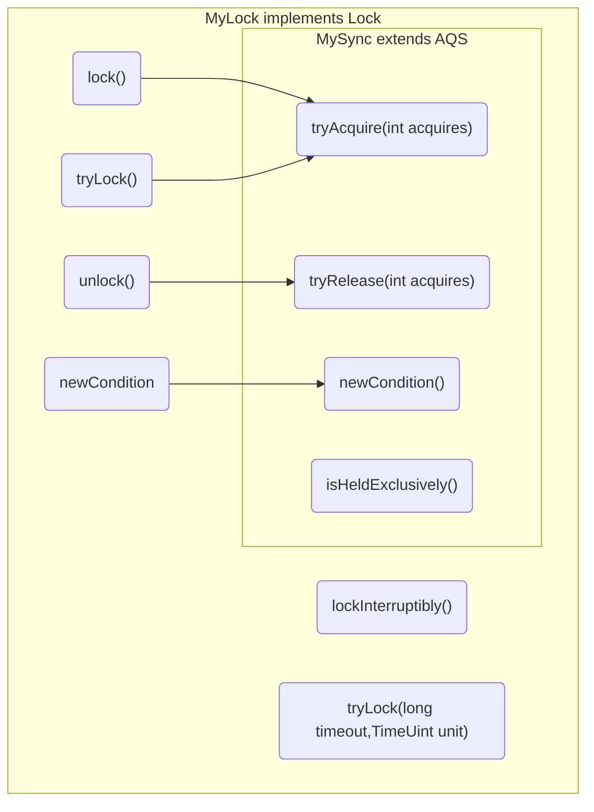
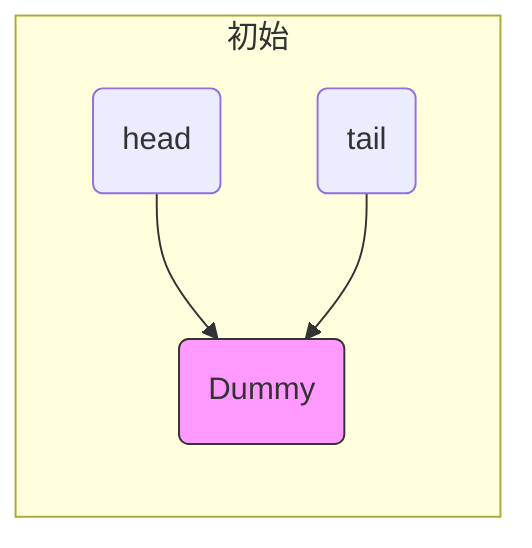
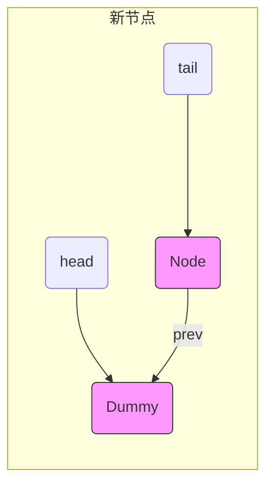

# Java并发工具-juc

## 1.AQS原理

### 1.1 概述

AQS全称是 AbstractQueuedSynchronizer，是阻塞式锁和相关的同步器工具的框架 .


特点:

- 用 state 属性来表示资源的状态（分独占模式和共享模式），子类需要定义如何维护这个状态，控制如何获取
  锁和释放锁 .

  - getState - 获取 state 状态  

  - setState - 设置 state 状态  

  - compareAndSetState - cas 机制设置 state 状态  

  - 独占模式是只有一个线程能够访问资源，而共享模式可以允许多个线程访问资源  

- 提供了基于 FIFO 的等待队列，类似于 Monitor 的 EntryList  

- 条件变量来实现等待、唤醒机制，支持多个条件变量，类似于 Monitor 的 WaitSet  

  

子类主要实现这样一些方法（默认抛出 UnsupportedOperationException） :

- tryAcquire
- tryRelease
- tryAcquireShared
- tryReleaseShared
- isHeldExclusively  


获取锁

```java
// 如果获取锁失败
if (!tryAcquire(arg)) {
	// 入队, 可以选择阻塞当前线程 park unpark
}
```

释放锁

```java
// 如果释放锁成功
if (tryRelease(arg)) {
	// 让阻塞线程恢复运行
}
```


### 1.2 自定义实现不可重入锁

要继承Lock接口实现自己的锁,要使用AQS实现自己的同步器.



>  自定义不可重入锁代码

```java
/**
 * 自定义不可重入锁
 */
class MyLock implements Lock {

    /**
     * 自定义AQS同步器
     */
    static class MySync extends AbstractQueuedSynchronizer {
        //获得锁
        @Override
        protected boolean tryAcquire(int arg) {
            if (arg == 1) {
                //此处不能用1次if判断,要用do...while做CAS操作
//                if (compareAndSetState(0, 1)) {
//                    setExclusiveOwnerThread(Thread.currentThread());
//                    setState(1);
//                    return true;
//                }
                do{

                }while(!compareAndSetState(0, 1));
                setExclusiveOwnerThread(Thread.currentThread());
                setState(1);
                return true;
            }
            return false;
        }

        //释放锁
        @Override
        protected boolean tryRelease(int arg) {
            if (arg == 1) {
                if (getState() == 0) {
                    throw new IllegalMonitorStateException();
                }
                setExclusiveOwnerThread(null);
                setState(0);
                return true;
            }
            return false;
        }

        //判断是否持有独占锁
        @Override
        protected boolean isHeldExclusively() {
            return getState() == 1;
        }

        //获取条件变量
        protected Condition newCondition() {
            return new ConditionObject();
        }
    }

    private static MySync mySync = new MySync();

    @Override
    public void lock() {
        mySync.tryAcquire(1);
    }

    @Override
    public void lockInterruptibly() throws InterruptedException {
        mySync.acquireInterruptibly(1);
    }

    @Override
    public boolean tryLock() {
        return mySync.tryAcquire(1);
    }

    @Override
    public boolean tryLock(long time, TimeUnit unit) throws InterruptedException {
        return mySync.tryAcquireNanos(1, unit.toNanos(time));
    }

    @Override
    public void unlock() {
        mySync.release(1);
    }

    @Override
    public Condition newCondition() {
        return mySync.newCondition();
    }
}

```

> 测试代码

```java
/**
 * 测试自定义不可重入锁
 */
@Slf4j(topic = "c.Test_AQS")
public class Test_AQS {

    static int i = 0;

    @Test
    public void test_MyAQS() {
        MyLock myLock = new MyLock();
        List<Thread> threadList = new ArrayList<>();
        for (int j = 0; j < 5; j++) {
            threadList.add(new Thread(() -> {
                myLock.lock();
                log.debug("获得锁...");
                try {
                    for (int k = 0; k < 10000; k++) {
                        i++;
                    }
                } catch (Exception e) {
                    e.printStackTrace();
                } finally {
                    myLock.unlock();
                    log.debug("释放锁...");
                }
            }));
        }
        for (int j = 0; j < 5; j++) {
            threadList.add(new Thread(() -> {
                myLock.lock();
                log.debug("获得锁...");
                try {
                    for (int k = 0; k < 10000; k++) {
                        i--;
                    }
                } catch (Exception e) {
                    e.printStackTrace();
                } finally {
                    myLock.unlock();
                    log.debug("释放锁...");

                }
            }));
        }
        threadList.forEach((s) -> {
            s.start();
        });
        threadList.forEach((s) -> {
            try {
                s.join();
            } catch (InterruptedException e) {
                e.printStackTrace();
            }
        });
        log.debug("i={}", i);
    }

}
```

> 输出

```java
11:48:44.333 [Thread-0] DEBUG c.Test_AQS - 获得锁...
11:48:44.339 [Thread-1] DEBUG c.Test_AQS - 获得锁...
11:48:44.340 [Thread-1] DEBUG c.Test_AQS - 释放锁...
11:48:44.339 [Thread-0] DEBUG c.Test_AQS - 释放锁...
11:48:44.340 [Thread-2] DEBUG c.Test_AQS - 获得锁...
11:48:44.341 [Thread-2] DEBUG c.Test_AQS - 释放锁...
11:48:44.341 [Thread-3] DEBUG c.Test_AQS - 获得锁...
11:48:44.341 [Thread-3] DEBUG c.Test_AQS - 释放锁...
11:48:44.341 [Thread-4] DEBUG c.Test_AQS - 获得锁...
11:48:44.342 [Thread-4] DEBUG c.Test_AQS - 释放锁...
11:48:44.342 [Thread-5] DEBUG c.Test_AQS - 获得锁...
11:48:44.343 [Thread-5] DEBUG c.Test_AQS - 释放锁...
11:48:44.343 [Thread-6] DEBUG c.Test_AQS - 获得锁...
11:48:44.343 [Thread-6] DEBUG c.Test_AQS - 释放锁...
11:48:44.344 [Thread-8] DEBUG c.Test_AQS - 获得锁...
11:48:44.345 [Thread-8] DEBUG c.Test_AQS - 释放锁...
11:48:44.345 [Thread-9] DEBUG c.Test_AQS - 获得锁...
11:48:44.345 [Thread-9] DEBUG c.Test_AQS - 释放锁...
11:48:44.345 [Thread-7] DEBUG c.Test_AQS - 获得锁...
11:48:44.346 [Thread-7] DEBUG c.Test_AQS - 释放锁...
11:48:44.346 [main] DEBUG c.Test_AQS - i=0
```


### 1.3 AQS实现的目标

早期程序员会自己通过一种同步器去实现另一种相近的同步器，例如用可重入锁去实现信号量，或反之。这显然不
够优雅，于是在 JSR166（java 规范提案）中创建了 AQS，提供了这种通用的同步器机制。  


AQS实现的功能目标:

阻塞版本获取锁 acquire 和非阻塞的版本尝试获取锁 tryAcquire  

获取锁超时机制  

通过打断取消机制  

独占机制及共享机制  

条件不满足时的等待机制  


AQS要实现的性能目标:

Instead, the primary performance goal here is scalability: to predictably maintain efficiency even, or
especially, when synchronizers are contended.  


###  1.4 AQS设计思想

获取锁的逻辑

```java
while(state 状态不允许获取) {
    if(队列中还没有此线程) {
        入队并阻塞
    }
}
当前线程出队
```


释放锁的逻辑

```java
if(state 状态允许了) {
	恢复阻塞的线程(s)
}
```


要点:

- 原子维护 state 状态
- 阻塞及恢复线程
- 维护队列


**1) state** **设计**

- state 使用 volatile 配合 cas 保证其修改时的原子性
- state 使用了 32bit int 来维护同步状态，因为当时使用 long 在很多平台下测试的结果并不理想

**2)** **阻塞恢复设计**

- 早期的控制线程暂停和恢复的 api 有 suspend 和 resume，但它们是不可用的，因为如果先调用的 resume
  那么 suspend 将感知不到
- 解决方法是使用 park & unpark 来实现线程的暂停和恢复，具体原理在之前讲过了，先 unpark 再 park 也没
  问题
- park & unpark 是针对线程的，而不是针对同步器的，因此控制粒度更为精细
- park 线程还可以通过 interrupt 打断

**3)** **队列设计**

- 使用了 FIFO 先入先出队列，并不支持优先级队列
- 设计时借鉴了 CLH 队列，它是一种单向无锁队列  





队列中有 head 和 tail 两个指针节点，都用 volatile 修饰配合 cas 使用，每个节点有 state 维护节点状态 .


入队伪代码，只需要考虑 tail 赋值的原子性  :

```java
do {
    // 原来的 tail
    Node prev = tail;
    // 用 cas 在原来 tail 的基础上改为 node
} while(tail.compareAndSet(prev, node))
```


出队伪代码  

```java
// prev 是上一个节点
while((Node prev=node.prev).state != 唤醒状态) {
}
// 设置头节点
head = node;
```


CLH好处:

- 无锁,使用自旋
- 快速,无阻塞


AQS 在一些方面改进了 CLH  :

```java
private Node enq(final Node node) {
    for (;;) {
        Node t = tail;
        // 队列中还没有元素 tail 为 null
        if (t == null) {
            // 将 head 从 null -> dummy
            if (compareAndSetHead(new Node()))
                tail = head;
            } else {
            // 将 node 的 prev 设置为原来的 tail
            node.prev = t;
            // 将 tail 从原来的 tail 设置为 node
            if (compareAndSetTail(t, node)) {
                // 原来 tail 的 next 设置为 node
                t.next = node;
                return t;
            }
        }
    }
}
```


### 1.5 主要用到的AQS并发工具类


ReentrantLock

ReentrantreadWriteLock

Semaphore


## 2.ReentrantLock原理


### 2.1 非公平锁实现原理

#### 2.1.1 加锁,解锁流程

先从构造器开始看，默认为非公平锁实现  

```java
public ReentrantLock() {
	sync = new NonfairSync();
}
```

NonfairSync 继承自 AQS


没有竞争(只有Thread-0)时:


当第一个竞争(Thread-1)出现时:


Thread-1 执行了
1.CAS 尝试将 state 由 0 改为 1，结果失败
2.进入 tryAcquire 逻辑，这时 state 已经是1，结果仍然失败
3.接下来进入 addWaiter 逻辑，构造 Node 队列

   - 图中黄色三角表示该 Node 的 waitStatus 状态，其中 0 为默认正常状态
   - Node 的创建是懒惰的
   - 其中第一个 Node 称为 Dummy（哑元）或哨兵，用来占位，并不关联线程  


当前线程进入 acquireQueued 逻辑
1.acquireQueued 会在一个死循环中不断尝试获得锁，失败后进入 park 阻塞
2.如果自己是紧邻着 head（排第二位），那么再次 tryAcquire 尝试获取锁，当然这时 state 仍为 1，失败
3.进入 shouldParkAfterFailedAcquire 逻辑，将前驱 node，即 head 的 waitStatus 改为 -1，这次返回 false  


4.shouldParkAfterFailedAcquire 执行完毕回到 acquireQueued ，再次 tryAcquire 尝试获取锁，当然这时
state 仍为 1，失败

5.当再次进入 shouldParkAfterFailedAcquire 时，这时因为其前驱 node 的 waitStatus 已经是 -1，这次返回
true

6.进入 parkAndCheckInterrupt， Thread-1 park（灰色表示）  


再次有多个线程经历上述过程竞争失败，变成这个样子  


Thread-0 释放锁，进入 tryRelease 流程，如果成功

- 设置 exclusiveOwnerThread 为 null
- state = 0  


当前队列不为 null，并且 head 的 waitStatus = -1，进入 unparkSuccessor 流程
找到队列中离 head 最近的一个 Node（没取消的），unpark 恢复其运行，本例中即为 Thread-1
回到 Thread-1 的 acquireQueued 流程  

- 如果加锁成功（没有竞争），会设置
  exclusiveOwnerThread 为 Thread-1，state = 1
  head 指向刚刚 Thread-1 所在的 Node，该 Node 清空 Thread
  原本的 head 因为从链表断开，而可被垃圾回收

  

- 如果这时候有其它线程来竞争（非公平的体现），例如这时有 Thread-4 来了  


如果不巧又被 Thread-4 占了先

- Thread-4 被设置为 exclusiveOwnerThread，state = 1
- Thread-1 再次进入 acquireQueued 流程，获取锁失败，重新进入 park 阻塞  


#### 2.1.2 加锁源码

**Sync**

该类继承了AbstractQueuedSynchronizer

```java
abstract static class Sync extends AbstractQueuedSynchronizer {
        private static final long serialVersionUID = -5179523762034025860L;

        /**
         * Performs {@link Lock#lock}. The main reason for subclassing
         * is to allow fast path for nonfair version.
         */
        abstract void lock();

        /**
         * Performs non-fair tryLock.  tryAcquire is implemented in
         * subclasses, but both need nonfair try for trylock method.
         */
        final boolean nonfairTryAcquire(int acquires) {
            final Thread current = Thread.currentThread();
            int c = getState();
            if (c == 0) {
                if (compareAndSetState(0, acquires)) {
                    setExclusiveOwnerThread(current);
                    return true;
                }
            }
            else if (current == getExclusiveOwnerThread()) {
                int nextc = c + acquires;
                if (nextc < 0) // overflow
                    throw new Error("Maximum lock count exceeded");
                setState(nextc);
                return true;
            }
            return false;
        }

        protected final boolean tryRelease(int releases) {
            int c = getState() - releases;
            if (Thread.currentThread() != getExclusiveOwnerThread())
                throw new IllegalMonitorStateException();
            boolean free = false;
            if (c == 0) {
                free = true;
                setExclusiveOwnerThread(null);
            }
            setState(c);
            return free;
        }

        protected final boolean isHeldExclusively() {
            // While we must in general read state before owner,
            // we don't need to do so to check if current thread is owner
            return getExclusiveOwnerThread() == Thread.currentThread();
        }

        final ConditionObject newCondition() {
            return new ConditionObject();
        }

        // Methods relayed from outer class

        final Thread getOwner() {
            return getState() == 0 ? null : getExclusiveOwnerThread();
        }

        final int getHoldCount() {
            return isHeldExclusively() ? getState() : 0;
        }

        final boolean isLocked() {
            return getState() != 0;
        }

        /**
         * Reconstitutes the instance from a stream (that is, deserializes it).
         */
        private void readObject(java.io.ObjectInputStream s)
            throws java.io.IOException, ClassNotFoundException {
            s.defaultReadObject();
            setState(0); // reset to unlocked state
        }
    }
```


**NonfairSync**

```java
//Sync继承自AQS
static final class NonfairSync extends Sync {
    private static final long serialVersionUID = 7316153563782823691L;

    //加锁实现
    final void lock() {
        // 首先用 cas 尝试（仅尝试一次）将 state 从 0 改为 1, 如果成功表示获得了独占锁
        if (compareAndSetState(0, 1))
            //cas成功,当前线程获得独占锁
            setExclusiveOwnerThread(Thread.currentThread());
        else
            // 如果尝试失败，进入[方法一]
            acquire(1);
    }
	
    //[方法一]AQS 继承过来的方法, 方便阅读, 放在此处
	public final void acquire(int arg) {
        //[方法二]tryAcquire
        if (!tryAcquire(arg) &&
            // 当 tryAcquire 返回为 false 时, 先调用 [方法四]addWaiter, 接着[方法五] acquireQueued
            acquireQueued(addWaiter(Node.EXCLUSIVE), arg))
            selfInterrupt();
    }
    
    // [方法二]进入[方法三]
    protected final boolean tryAcquire(int acquires) {
        return nonfairTryAcquire(acquires);
    }
    
    //[方法四]AQS 继承过来的方法, 方便阅读, 放在此处
    private Node addWaiter(Node mode) {
        // 将当前线程关联到一个 Node 对象上, 模式为独占模式,Node.EXCLUSIVE
        Node node = new Node(Thread.currentThread(), mode);
        // 如果 tail 不为 null, cas 尝试将 Node 对象加入 AQS 队列尾部
        Node pred = tail;
        if (pred != null) {
            node.prev = pred;
            if (compareAndSetTail(pred, node)) {
                // 双向链表
                pred.next = node;
                return node;
            }
        }
        // 尝试将 Node 加入 AQS, 进入[方法六]
        enq(node);
        return node;
    }
    
    //[方法六]AQS 继承过来的方法, 方便阅读, 放在此处
        private Node enq(final Node node) {
        for (;;) {
            Node t = tail;
            if (t == null) { // Must initialize
                // 还没有, 设置 head 为哨兵节点（不对应线程，状态为 0）
                if (compareAndSetHead(new Node()))
                    tail = head;
            } else {
                node.prev = t;
                // cas 尝试将 Node 对象加入 AQS 队列尾部
                if (compareAndSetTail(t, node)) {
                    t.next = node;
                    return t;
                }
            }
        }
    }
    
    //[方法五]AQS 继承过来的方法, 方便阅读, 放在此处
    final boolean acquireQueued(final Node node, int arg) {
        boolean failed = true;
        try {
            boolean interrupted = false;
            for (;;) {
                final Node p = node.predecessor();
                // 上一个节点是 head, 表示轮到自己（当前线程对应的 node）了, 尝试获取 	
                if (p == head && tryAcquire(arg)) {
                    // 获取成功, 设置自己（当前线程对应的 node）为 head
                    setHead(node);
                    // 上一个节点 help GC
                    p.next = null; // help GC
                    failed = false;
                    // 返回中断标记 false
                    return interrupted;
                }
                if (
                    // 判断是否应当 park, 进入[方法七]
                    shouldParkAfterFailedAcquire(p, node) &&
                    // park 等待, 此时 Node 的状态被置为 Node.SIGNAL[方法八]
                    parkAndCheckInterrupt()
                   )
                    interrupted = true;
            }
        } finally {
            if (failed)
                cancelAcquire(node);
        }
    }
    
    // [方法七]AQS 继承过来的方法, 方便阅读, 放在此处
    private static boolean shouldParkAfterFailedAcquire(Node pred, Node node) {
        // 获取上一个节点的状态
        int ws = pred.waitStatus;
        if (ws == Node.SIGNAL)
            // 上一个节点都在阻塞, 那么自己也阻塞好了
            return true;
        // > 0 表示取消状态
        if (ws > 0) {
            // 上一个节点取消, 那么重构删除前面所有取消的节点, 返回到外层循环重试
            do {
                node.prev = pred = pred.prev;
            } while (pred.waitStatus > 0);
            pred.next = node;
        } else {
            // 这次还没有阻塞
			// 但下次如果重试不成功, 则需要阻塞，这时需要设置上一个节点状态为 Node.SIGNAL
            compareAndSetWaitStatus(pred, ws, Node.SIGNAL);
        }
        return false;
    }
    
    //[方法八] 阻塞当前线程,AQS 继承过来的方法, 方便阅读, 放在此处
    private final boolean parkAndCheckInterrupt() {
        LockSupport.park(this);
        return Thread.interrupted();
    }

}
```


#### 2.1.3 解锁源码

```java
    //解锁实现
    public void unlock() {
            sync.release(1);
    }

	// AQS 继承过来的方法, 方便阅读, 放在此处
    public final boolean release(int arg) {
        // 尝试释放锁, 进入 ㈠
        if (tryRelease(arg)) {
            // 队列头节点 unpark
            Node h = head;
            if (
                // 队列不为 null
                h != null && 
                // waitStatus == Node.SIGNAL 才需要 unpark
                h.waitStatus != 0)
                // unpark AQS 中等待的线程, 进入 ㈡
                unparkSuccessor(h);
            return true;
        }
        return false;
    }


```


## 3.读写锁


## 4.读写锁原理


## 5.Semaphore


## 6.Semaphore原理


## 7.CountdownLatch


## 8.CyclicBarrier


## 9 .ConcurrentHashMap


## 10.ConcurrentLinkedQueue


## 11.BlockingQueue


