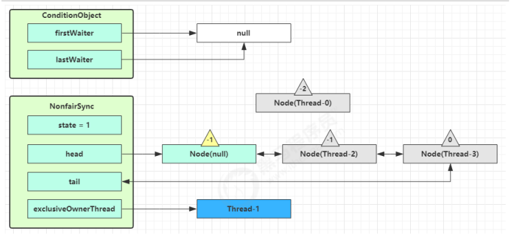

# Java并发工具-juc

## 1.AQS原理

### 1.1 概述

AQS全称是 AbstractQueuedSynchronizer，是阻塞式锁和相关的同步器工具的框架 .


AQS的几种状态:

```java
/** waitStatus value to indicate thread has cancelled */
//1:线程已经获得锁
static final int CANCELLED =  1;
/** waitStatus value to indicate successor's thread needs unparking */
//-1 :唤醒后继节点
static final int SIGNAL    = -1;
/** waitStatus value to indicate thread is waiting on condition */
//-2 :在条件变量中
static final int CONDITION = -2;
/**
 * waitStatus value to indicate the next acquireShared should
 * unconditionally propagate
 */
static final int PROPAGATE = -3;
```


特点:

- 用 state 属性来表示资源的状态（分独占模式和共享模式），子类需要定义如何维护这个状态，控制如何获取
  锁和释放锁 .

  - getState - 获取 state 状态  

  - setState - 设置 state 状态  

  - compareAndSetState - cas 机制设置 state 状态  

  - 独占模式是只有一个线程能够访问资源，而共享模式可以允许多个线程访问资源  

- 提供了基于 FIFO 的等待队列，类似于 Monitor 的 EntryList  

- 条件变量来实现等待、唤醒机制，支持多个条件变量，类似于 Monitor 的 WaitSet  

  

子类主要实现这样一些方法（默认抛出 UnsupportedOperationException） :

- tryAcquire  尝试获得锁
- tryRelease  尝试释放锁
- tryAcquireShared
- tryReleaseShared
- isHeldExclusively    判断是否获得锁


获取锁

```java
// 如果获取锁失败
if (!tryAcquire(arg)) {
	// 入队, 可以选择阻塞当前线程 park unpark
}
```

释放锁

```java
// 如果释放锁成功
if (tryRelease(arg)) {
	// 让阻塞线程恢复运行
}
```


### 1.2 自定义实现不可重入锁

要继承Lock接口实现自己的锁,要使用AQS实现自己的同步器.


>  自定义不可重入锁代码

```java
/**
 * 自定义不可重入锁
 */
class MyLock implements Lock {

    /**
     * 自定义AQS同步器
     */
    static class MySync extends AbstractQueuedSynchronizer {
        //获得锁
        @Override
        protected boolean tryAcquire(int arg) {
            if (arg == 1) {
                //此处不能用1次if判断,要用do...while做CAS操作
//                if (compareAndSetState(0, 1)) {
//                    setExclusiveOwnerThread(Thread.currentThread());
//                    setState(1);
//                    return true;
//                }
                do{

                }while(!compareAndSetState(0, 1));
                setExclusiveOwnerThread(Thread.currentThread());
                setState(1);
                return true;
            }
            return false;
        }

        //释放锁
        @Override
        protected boolean tryRelease(int arg) {
            if (arg == 1) {
                if (getState() == 0) {
                    throw new IllegalMonitorStateException();
                }
                setExclusiveOwnerThread(null);
                setState(0);
                return true;
            }
            return false;
        }

        //判断是否持有独占锁
        @Override
        protected boolean isHeldExclusively() {
            return getState() == 1;
        }

        //获取条件变量
        protected Condition newCondition() {
            return new ConditionObject();
        }
    }

    private static MySync mySync = new MySync();

    @Override
    public void lock() {
        mySync.tryAcquire(1);
    }

    @Override
    public void lockInterruptibly() throws InterruptedException {
        mySync.acquireInterruptibly(1);
    }

    @Override
    public boolean tryLock() {
        return mySync.tryAcquire(1);
    }

    @Override
    public boolean tryLock(long time, TimeUnit unit) throws InterruptedException {
        return mySync.tryAcquireNanos(1, unit.toNanos(time));
    }

    @Override
    public void unlock() {
        mySync.release(1);
    }

    @Override
    public Condition newCondition() {
        return mySync.newCondition();
    }
}

```

> 测试代码

```java
/**
 * 测试自定义不可重入锁
 */
@Slf4j(topic = "c.Test_AQS")
public class Test_AQS {

    static int i = 0;

    @Test
    public void test_MyAQS() {
        MyLock myLock = new MyLock();
        List<Thread> threadList = new ArrayList<>();
        for (int j = 0; j < 5; j++) {
            threadList.add(new Thread(() -> {
                myLock.lock();
                log.debug("获得锁...");
                try {
                    for (int k = 0; k < 10000; k++) {
                        i++;
                    }
                } catch (Exception e) {
                    e.printStackTrace();
                } finally {
                    myLock.unlock();
                    log.debug("释放锁...");
                }
            }));
        }
        for (int j = 0; j < 5; j++) {
            threadList.add(new Thread(() -> {
                myLock.lock();
                log.debug("获得锁...");
                try {
                    for (int k = 0; k < 10000; k++) {
                        i--;
                    }
                } catch (Exception e) {
                    e.printStackTrace();
                } finally {
                    myLock.unlock();
                    log.debug("释放锁...");

                }
            }));
        }
        threadList.forEach((s) -> {
            s.start();
        });
        threadList.forEach((s) -> {
            try {
                s.join();
            } catch (InterruptedException e) {
                e.printStackTrace();
            }
        });
        log.debug("i={}", i);
    }

}
```

> 输出

```java
11:48:44.333 [Thread-0] DEBUG c.Test_AQS - 获得锁...
11:48:44.339 [Thread-1] DEBUG c.Test_AQS - 获得锁...
11:48:44.340 [Thread-1] DEBUG c.Test_AQS - 释放锁...
11:48:44.339 [Thread-0] DEBUG c.Test_AQS - 释放锁...
11:48:44.340 [Thread-2] DEBUG c.Test_AQS - 获得锁...
11:48:44.341 [Thread-2] DEBUG c.Test_AQS - 释放锁...
11:48:44.341 [Thread-3] DEBUG c.Test_AQS - 获得锁...
11:48:44.341 [Thread-3] DEBUG c.Test_AQS - 释放锁...
11:48:44.341 [Thread-4] DEBUG c.Test_AQS - 获得锁...
11:48:44.342 [Thread-4] DEBUG c.Test_AQS - 释放锁...
11:48:44.342 [Thread-5] DEBUG c.Test_AQS - 获得锁...
11:48:44.343 [Thread-5] DEBUG c.Test_AQS - 释放锁...
11:48:44.343 [Thread-6] DEBUG c.Test_AQS - 获得锁...
11:48:44.343 [Thread-6] DEBUG c.Test_AQS - 释放锁...
11:48:44.344 [Thread-8] DEBUG c.Test_AQS - 获得锁...
11:48:44.345 [Thread-8] DEBUG c.Test_AQS - 释放锁...
11:48:44.345 [Thread-9] DEBUG c.Test_AQS - 获得锁...
11:48:44.345 [Thread-9] DEBUG c.Test_AQS - 释放锁...
11:48:44.345 [Thread-7] DEBUG c.Test_AQS - 获得锁...
11:48:44.346 [Thread-7] DEBUG c.Test_AQS - 释放锁...
11:48:44.346 [main] DEBUG c.Test_AQS - i=0
```


### 1.3 AQS实现的目标

早期程序员会自己通过一种同步器去实现另一种相近的同步器，例如用可重入锁去实现信号量，或反之。这显然不
够优雅，于是在 JSR166（java 规范提案）中创建了 AQS，提供了这种通用的同步器机制。  


AQS实现的功能目标:

阻塞版本获取锁 acquire 和非阻塞的版本尝试获取锁 tryAcquire  

获取锁超时机制  

通过打断取消机制  

独占机制及共享机制  

条件不满足时的等待机制  


AQS要实现的性能目标:

Instead, the primary performance goal here is scalability: to predictably maintain efficiency even, or
especially, when synchronizers are contended.  


###  1.4 AQS设计思想

获取锁的逻辑

```java
while(state 状态不允许获取) {
    if(队列中还没有此线程) {
        入队并阻塞
    }
}
当前线程出队
```


释放锁的逻辑

```java
if(state 状态允许了) {
	恢复阻塞的线程(s)
}
```


要点:

- 原子维护 state 状态
- 阻塞及恢复线程
- 维护队列


**1) state** **设计**

- state 使用 volatile 配合 cas 保证其修改时的原子性
- state 使用了 32bit int 来维护同步状态，因为当时使用 long 在很多平台下测试的结果并不理想

**2)** **阻塞恢复设计**

- 早期的控制线程暂停和恢复的 api 有 suspend 和 resume，但它们是不可用的，因为如果先调用的 resume
  那么 suspend 将感知不到
- 解决方法是使用 park & unpark 来实现线程的暂停和恢复，具体原理在之前讲过了，先 unpark 再 park 也没
  问题
- park & unpark 是针对线程的，而不是针对同步器的，因此控制粒度更为精细
- park 线程还可以通过 interrupt 打断

**3)** **队列设计**

- 使用了 FIFO 先入先出队列，并不支持优先级队列
- 设计时借鉴了 CLH 队列，它是一种单向无锁队列  


队列中有 head 和 tail 两个指针节点，都用 volatile 修饰配合 cas 使用，每个节点有 state 维护节点状态 .


入队伪代码，只需要考虑 tail 赋值的原子性  :

```java
do {
    // 原来的 tail
    Node prev = tail;
    // 用 cas 在原来 tail 的基础上改为 node
} while(tail.compareAndSet(prev, node))
```


出队伪代码  

```java
// prev 是上一个节点
while((Node prev=node.prev).state != 唤醒状态) {
}
// 设置头节点
head = node;
```


CLH好处:

- 无锁,使用自旋
- 快速,无阻塞


AQS 在一些方面改进了 CLH  :

```java
private Node enq(final Node node) {
    for (;;) {
        Node t = tail;
        // 队列中还没有元素 tail 为 null
        if (t == null) {
            // 将 head 从 null -> dummy
            if (compareAndSetHead(new Node()))
                tail = head;
            } else {
            // 将 node 的 prev 设置为原来的 tail
            node.prev = t;
            // 将 tail 从原来的 tail 设置为 node
            if (compareAndSetTail(t, node)) {
                // 原来 tail 的 next 设置为 node
                t.next = node;
                return t;
            }
        }
    }
}
```


### 1.5 主要用到的AQS并发工具类


ReentrantLock

ReentrantreadWriteLock

Semaphore


## 2.ReentrantLock原理


### 2.1 非公平锁实现原理

#### 2.1.1 加锁,解锁流程

先从构造器开始看，默认为非公平锁实现  

```java
public ReentrantLock() {
	sync = new NonfairSync();
}
```

NonfairSync 继承自 AQS


当没有竞争(只有Thread-0)时:


当第一个竞争(Thread-1)出现时:


Thread-1 执行了
1.CAS 尝试将 state 由 0 改为 1，结果失败
2.进入 tryAcquire 逻辑，这时 state 已经是1，结果仍然失败
3.接下来进入 addWaiter 逻辑，构造 Node 队列

   - 图中黄色三角表示该 Node 的 waitStatus 状态，其中 0 为默认正常状态
   - Node 的创建是懒惰的
   - 其中第一个 Node 称为 Dummy（哑元）或哨兵，用来占位，并不关联线程  


当前线程进入 acquireQueued 逻辑(维护AQS队列,创建节点Node且该节点关联当前线程)
1.acquireQueued 会在一个死循环中不断尝试获得锁，失败后进入 park 阻塞()
2.如果自己是紧邻着 head（排第二位），那么再次 tryAcquire 尝试获取锁，当然这时 state 仍为 1，失败
3.进入 shouldParkAfterFailedAcquire 逻辑，将前驱 node，即 head 的 waitStatus 改为 -1，这次返回 false  


4.shouldParkAfterFailedAcquire 执行完毕回到 acquireQueued ，再次 tryAcquire 尝试获取锁，当然这时
state 仍为 1，失败

5.当再次进入 shouldParkAfterFailedAcquire 时，这时因为其前驱 node 的 waitStatus 已经是 -1，这次返回
true

6.进入 parkAndCheckInterrupt， Thread-1 park（灰色表示）  


再次有多个线程经历上述过程竞争失败，变成这个样子  


Thread-0 释放锁，进入 tryRelease 流程，如果成功

- 设置 exclusiveOwnerThread 为 null
- state = 0  


当前队列不为 null，并且 head 的 waitStatus = -1，进入 unparkSuccessor 流程
找到队列中离 head 最近的一个 Node（没取消的），unpark 恢复其运行，本例中即为 Thread-1
回到 Thread-1 的 acquireQueued 流程  

- 如果加锁成功（没有竞争），会设置
  exclusiveOwnerThread 为 Thread-1，state = 1
  head 指向刚刚 Thread-1 所在的 Node，该 Node 清空 Thread
  原本的 head 因为从链表断开，而可被垃圾回收

  

- 如果这时候有其它线程来竞争（非公平的体现），例如这时有 Thread-4 来了  


如果不巧又被 Thread-4 占了先

- Thread-4 被设置为 exclusiveOwnerThread，state = 1
- Thread-1 再次进入 acquireQueued 流程，获取锁失败，重新进入 park 阻塞  


#### 2.1.2 加锁源码

自己归纳的,

```java
//加锁
final void lock() {
    		//如果cas更改状态当前线程状态成功,0-->1 则当前线程获得锁
            if (compareAndSetState(0, 1))
                //设置独占锁为当前线程
                setExclusiveOwnerThread(Thread.currentThread());
            else
                //cas更新失败,尝试获得锁
                acquire(1);
        }

	//AQS方法,前线程的aqs状态,0(没有线程独占锁)--->1(当前线程独占锁)
    protected final boolean compareAndSetState(int expect, int update) {
        // See below for intrinsics setup to support this
        return unsafe.compareAndSwapInt(this, stateOffset, expect, update);
    }

	//AbstractOwnableSynchronizer类方法,设置独占锁为当前线程
	protected final void setExclusiveOwnerThread(Thread thread) {
        exclusiveOwnerThread = thread;
    }

	//ReentrantLock方法,尝试获得锁
	public final void acquire(int arg) {
        if (
            //再次尝试获得锁,没有获得锁会执行第二条,把线程添加到AQS队列
            !tryAcquire(arg) &&  
            // Marker to indicate a node is waiting in exclusive mode
            //static final Node EXCLUSIVE = null;
            acquireQueued(addWaiter(Node.EXCLUSIVE), arg)
           )
            selfInterrupt();
    }

	//尝试获得锁
   protected final boolean tryAcquire(int acquires) {
       		//获取当前线程
            final Thread current = Thread.currentThread();
       		//
            int c = getState();
            if (c == 0) {
                if (!hasQueuedPredecessors() &&
                    compareAndSetState(0, acquires)) {
                    setExclusiveOwnerThread(current);
                    return true;
                }
            }
            else if (current == getExclusiveOwnerThread()) {
                int nextc = c + acquires;
                if (nextc < 0)
                    throw new Error("Maximum lock count exceeded");
                setState(nextc);
                return true;
            }
            return false;
        }
    }
	

	//AQS类方法,
    private Node addWaiter(Node mode) {
        //创建新节点,新节点关联当前线程和状态EXCLUSIVE
        Node node = new Node(Thread.currentThread(), mode);
        Node pred = tail;
        if (pred != null) { //加入AQS队列的逻辑和enq中加入队列的逻辑一样
            node.prev = pred;
            //cas更新尾节点
            if (compareAndSetTail(pred, node)) {
                pred.next = node;
                return node;   //添加成功后将节点返回给acquireQueued
            }
        }
        enq(node);
        return node;//添加成功后将节点返回给acquireQueued
    }

	//AQS方法,将节点入队
	private Node enq(final Node node) {
        for (;;) {
            Node t = tail;  //尾节点
            //如果尾节点为空,则当前AQS队列为空,则创建新的AQS队列,并且令头head=尾tail
            //头和尾都指向哨兵节点Node(null)
            if (t == null) { 
                if (compareAndSetHead(new Node()))
                    tail = head;
            } else { //如果AQS队列不为空,
                node.prev = t;
                if (compareAndSetTail(t, node)) {
                    t.next = node;
                    return t;
                }
            }
        }
    }

	//AQS类方法,仅用在enqf()
    private final boolean compareAndSetHead(Node update) {
        return unsafe.compareAndSwapObject(this, headOffset, null, update);
    }

	//AQS类方法,尝试在AQS队列中获得锁
	final boolean acquireQueued(final Node node, int arg) {
        boolean failed = true;
        try {
            boolean interrupted = false;
            for (;;) { //死循环中阻塞,等待唤醒
                final Node p = node.predecessor(); //获取当前节点的前驱节点p
                if (
                    //如果当前节点的前驱是头节点
                    p == head && 
                    //则再次尝试获得锁
                    tryAcquire(arg)
                  ) {
                    //1.如果获得了锁
                    setHead(node);
                    p.next = null; // help GC
                    failed = false;
                    return interrupted;
                }
                //2.如果没获得锁
                if (shouldParkAfterFailedAcquire(p, node) &&
                    //再一次尝试获得锁,如果失败则会在parkAndCheckInterrupt方法中阻塞park
                    parkAndCheckInterrupt()  
                   ) 
                    interrupted = true;
            }
        } finally {
            if (failed)
                cancelAcquire(node);
        }
    }

    //AQS类方法,pred前驱节点,node当前节点
    //在获取锁失败后,是否应该阻塞
	private static boolean shouldParkAfterFailedAcquire(Node pred, Node node) {
        int ws = pred.waitStatus;  //获取前驱节点的状态
        if (ws == Node.SIGNAL)  //SIGNAL=-1  前驱节点为-1表示应该
            /*
             * This node has already set status asking a release
             * to signal it, so it can safely park.
             */
            return true;
        if (ws > 0) {  //大于0,
            /*
             * Predecessor was cancelled. Skip over predecessors and
             * indicate retry.
             */
            do {
                node.prev = pred = pred.prev;
            } while (pred.waitStatus > 0);
            pred.next = node;
        } else {   //等于0,
            /*
             * waitStatus must be 0 or PROPAGATE.  Indicate that we
             * need a signal, but don't park yet.  Caller will need to
             * retry to make sure it cannot acquire before parking.
             */
            compareAndSetWaitStatus(pred, ws, Node.SIGNAL);
        }
        return false;
    }

	//阻塞当前线程,清楚打断标记后返回true,interrupted=fasle
    private final boolean parkAndCheckInterrupt() {
        LockSupport.park(this);
        return Thread.interrupted();
    }

	//打断当前线程,恢复执行
    static void selfInterrupt() {
        Thread.currentThread().interrupt();
    }


```


老师归纳的,

```java
//Sync继承自AQS
static final class NonfairSync extends Sync {
    private static final long serialVersionUID = 7316153563782823691L;

    //加锁实现
    final void lock() {
        // 首先用 cas 尝试（仅尝试一次）将 state 从 0 改为 1, 如果成功表示获得了独占锁
        if (compareAndSetState(0, 1))
            //cas成功,当前线程获得独占锁
            setExclusiveOwnerThread(Thread.currentThread());
        else
            // 如果尝试失败，进入[1]
            acquire(1);
    }
	
    //[1]AQS 继承过来的方法, 方便阅读, 放在此处
	public final void acquire(int arg) {
        //[2]tryAcquire
        if (!tryAcquire(arg) &&
            // 当 tryAcquire 返回为 false 时(真), 先调用 [4]addWaiter, 接着[5] acquireQueued
            acquireQueued(addWaiter(Node.EXCLUSIVE), arg))
            selfInterrupt();
    }
    
    // [2]进入[3]
    protected final boolean tryAcquire(int acquires) {
        return nonfairTryAcquire(acquires);
    }
    
    //[4]AQS 继承过来的方法, 方便阅读, 放在此处
    private Node addWaiter(Node mode) {
        // 将当前线程关联到一个 Node 对象上, 模式为独占模式,Node.EXCLUSIVE
        Node node = new Node(Thread.currentThread(), mode);
        // 如果 tail 不为 null, cas 尝试将 Node 对象加入 AQS 队列尾部
        Node pred = tail;
        if (pred != null) {
            node.prev = pred;
            if (compareAndSetTail(pred, node)) {
                // 双向链表
                pred.next = node;
                return node;
            }
        }
        // 尝试将 Node 加入 AQS, 进入[6]
        enq(node);
        return node;
    }
    
    //[6]AQS 继承过来的方法, 方便阅读, 放在此处
        private Node enq(final Node node) {
        for (;;) {
            Node t = tail;
            if (t == null) { // Must initialize
                // 还没有, 设置 head 为哨兵节点（不对应线程，状态为 0）
                if (compareAndSetHead(new Node()))
                    tail = head;
            } else {
                node.prev = t;
                // cas 尝试将 Node 对象加入 AQS 队列尾部
                if (compareAndSetTail(t, node)) {
                    t.next = node;
                    return t;
                }
            }
        }
    }
    
    //[5]AQS 继承过来的方法, 方便阅读, 放在此处
    final boolean acquireQueued(final Node node, int arg) {
        boolean failed = true;
        try {
            boolean interrupted = false;
            for (;;) {
                final Node p = node.predecessor();
                // 上一个节点是 head, 表示轮到自己（当前线程对应的 node）了, 尝试获取 	
                if (p == head && tryAcquire(arg)) {
                    // 获取成功, 设置自己（当前线程对应的 node）为 head
                    setHead(node);
                    // 上一个节点 help GC
                    p.next = null; // help GC
                    failed = false;
                    // 返回中断标记 false
                    return interrupted;
                }
                if (
                    // 判断是否应当 park, 进入[7]
                    shouldParkAfterFailedAcquire(p, node) &&
                    // park 等待, 此时 Node 的状态被置为 Node.SIGNAL[方法八]
                    parkAndCheckInterrupt()
                   )
                    interrupted = true;
            }
        } finally {
            if (failed)
                cancelAcquire(node);
        }
    }
    
    // [7]AQS 继承过来的方法, 方便阅读, 放在此处
    private static boolean shouldParkAfterFailedAcquire(Node pred, Node node) {
        // 获取上一个节点的状态
        int ws = pred.waitStatus;
        if (ws == Node.SIGNAL)
            // 上一个节点都在阻塞, 那么自己也阻塞好了
            return true;
        // > 0 表示取消状态
        if (ws > 0) {
            // 上一个节点取消, 那么重构删除前面所有取消的节点, 返回到外层循环重试
            do {
                node.prev = pred = pred.prev;
            } while (pred.waitStatus > 0);
            pred.next = node;
        } else {
            // 这次还没有阻塞
			// 但下次如果重试不成功, 则需要阻塞，这时需要设置上一个节点状态为 Node.SIGNAL
            compareAndSetWaitStatus(pred, ws, Node.SIGNAL);
        }
        return false;
    }
    
    //[8] 阻塞当前线程,AQS 继承过来的方法, 方便阅读, 放在此处
    private final boolean parkAndCheckInterrupt() {
        LockSupport.park(this);
        return Thread.interrupted();
    }

}
```


#### 2.1.3 解锁源码

自己归纳的,

```java
//ReentantLock类方法,解锁
public void unlock() {
    sync.release(1);
}

	//AQAS类方法,尝试解锁
    public final boolean release(int arg) {
        if (tryRelease(arg)) { //解锁成功后,
            Node h = head;  
            if (h != null && h.waitStatus != 0)
                unparkSuccessor(h);  //唤醒AQS中等待的节点
            return true; //解锁成功返回true
        }
        return false;	//解锁失败返回false
    }
   		//ReentrantLock类方法,尝试释放锁
        protected final boolean tryRelease(int releases) {
            int c = getState() - releases; //AQS 的state-1(锁重入)
            if (Thread.currentThread() != getExclusiveOwnerThread())
                throw new IllegalMonitorStateException();
            boolean free = false; //在state不为0时,不能释放锁
            if (c == 0) {
                free = true;  //在state=0时,已经没有锁重入了,可以解锁
                setExclusiveOwnerThread(null); //解锁后,让独占锁不关联线程
            }
            setState(c); //重设state
            return free; //返回解锁状态
        } 

//AQS类方法,唤醒node后继节点
private void unparkSuccessor(Node node) {
        /*
         * If status is negative (i.e., possibly needing signal) try
         * to clear in anticipation of signalling.  It is OK if this
         * fails or if status is changed by waiting thread.
         */
        int ws = node.waitStatus;
        if (ws < 0)
            compareAndSetWaitStatus(node, ws, 0);

        /*
         * Thread to unpark is held in successor, which is normally
         * just the next node.  But if cancelled or apparently null,
         * traverse backwards from tail to find the actual
         * non-cancelled successor.
         */
        Node s = node.next;
        if (s == null || s.waitStatus > 0) {
            s = null;
            for (Node t = tail; t != null && t != node; t = t.prev)
                if (t.waitStatus <= 0)
                    s = t;
        }
        if (s != null)
            LockSupport.unpark(s.thread);
    }

```


老师归纳的,

```java
    //解锁实现
    public void unlock() {
            sync.release(1);
    }

	// AQS 继承过来的方法, 方便阅读, 放在此处
    public final boolean release(int arg) {
        // 尝试释放锁, 进入 [1]
        if (tryRelease(arg)) {
            // 队列头节点 unpark
            Node h = head;
            if (
                // 队列不为 null
                h != null && 
                // waitStatus == Node.SIGNAL 才需要 unpark
                h.waitStatus != 0)
                // unpark AQS 中等待的线程, 进入[2]
                unparkSuccessor(h);
            return true;  //释放锁成功,返回true
        }
        return false;  //释放锁失败,返回false
    }


    //[1]Sync 继承过来的方法, 方便阅读, 放在此处
    protected final boolean tryRelease(int releases) {
        // state--
        int c = getState() - releases;
        if (Thread.currentThread() != getExclusiveOwnerThread())
            throw new IllegalMonitorStateException();
        //如果free=false表示释放锁失败
        boolean free = false;  
        // 支持锁重入, 只有 state 减为 0, 才释放成功
        if (c == 0) {
            free = true;   //free=true表示释放成功
            setExclusiveOwnerThread(null);  //将独占锁设为空
        }
        setState(c);  //修改独占所状态,如果释放成功则state=0
        return free;  //返回释放锁的状态
    }

    // [2] AQS 继承过来的方法, 方便阅读, 放在此处
    private void unparkSuccessor(Node node) {
        // 如果状态为 Node.SIGNAL 尝试重置状态为 0
        // 不成功也可以
    	int ws = node.waitStatus;
        if (ws < 0) {
        	compareAndSetWaitStatus(node, ws, 0);
        }
        // 找到需要 unpark 的节点, 但本节点从 AQS 队列中脱离, 是由唤醒节点完成的
        Node s = node.next;
        // 不考虑已取消的节点, 从 AQS 队列从后至前找到队列最前面需要 unpark 的节点
        if (s == null || s.waitStatus > 0) {
            s = null;
            for (Node t = tail; t != null && t != node; t = t.prev)
                if (t.waitStatus <= 0)
                    s = t;
        	}
        	if (s != null)
        	LockSupport.unpark(s.thread);
   }

```


### 2.2 可重入原理

>  自己归纳

```java
//锁重入    
public boolean tryLock() {
        return sync.nonfairTryAcquire(1);
    }

//非公平加锁/锁重入
final boolean nonfairTryAcquire(int acquires) {
            final Thread current = Thread.currentThread();  //当前线程
            int c = getState();  //获取锁状态
            if (c == 0) { //状态=0,没有锁重入
                if (compareAndSetState(0, acquires)) { //cas独占锁
                    setExclusiveOwnerThread(current);
                    return true;
                }
            }
            else if (current == getExclusiveOwnerThread()) { //锁重入
                int nextc = c + acquires; //每重入1次,+1
                if (nextc < 0) // overflow
                    throw new Error("Maximum lock count exceeded");
                setState(nextc);
                return true;
            }
            return false;
        }

//释放锁
 protected final boolean tryRelease(int releases) {
            int c = getState() - releases; //锁重入每减少1层,状态-1
            if (Thread.currentThread() != getExclusiveOwnerThread())
                throw new IllegalMonitorStateException();
            boolean free = false;
            if (c == 0) {  //状态=0,没有线程独占锁,释放锁
                free = true;
                setExclusiveOwnerThread(null);
            }
            setState(c);
            return free;
        }
```


>  老师归纳

```java
static final class NonfairSync extends Sync {
	// ...
	// Sync 继承过来的方法, 方便阅读, 放在此处
	final boolean nonfairTryAcquire(int acquires) {
		final Thread current = Thread.currentThread();
        int c = getState();
		if (c == 0) {	//如果没有线程获得锁,不发生锁重入
			if (compareAndSetState(0, acquires)) { 
				setExclusiveOwnerThread(current);
				return true; //cas变更state状态成功后获取锁
			}
		}
        // 如果已经获得了锁, 线程还是当前线程, 表示发生了锁重入
		else if (current == getExclusiveOwnerThread()) {
        	// state++
        	int nextc = c + acquires;
        	if (nextc < 0) // overflow
        		throw new Error("Maximum lock count exceeded");
        	setState(nextc);
       	 	return true;
        }
        return false;
    }
    
    // Sync 继承过来的方法, 方便阅读, 放在此处
    protected final boolean tryRelease(int releases) {
    	// state--
    	int c = getState() - releases;
    	if (Thread.currentThread() != getExclusiveOwnerThread())
    		throw new IllegalMonitorStateException();
    	boolean free = false;
    	// 支持锁重入, 只有 state 减为 0, 
    	if (c == 0) {
    		free = true;
    		setExclusiveOwnerThread(null);
    	}
    	setState(c);
    	return free;
    }
}
    
```


### 2.3可打断原理

#### 2.3.1 不可打断模式

在此模式下，即使它被打断，仍会驻留在 AQS 队列中，一直要等到获得锁后方能得知自己被打断了 .

> 自己归纳

```java
    final boolean acquireQueued(final Node node, int arg) {
        boolean failed = true;
        try {
            boolean interrupted = false;
            for (;;) {
                final Node p = node.predecessor();
                if (p == head && tryAcquire(arg)) {
                    setHead(node);
                    p.next = null; // help GC
                    failed = false;
                    return interrupted; //执行到此处返回打断标记
                }
                if (shouldParkAfterFailedAcquire(p, node) &&
                    parkAndCheckInterrupt())
                    //不可打断模式下,打断线程后,不会立刻结束执行,而是修改了打断标记,继续执行
                    interrupted = true;  
            }
        } finally {
            if (failed)
                cancelAcquire(node);
        }
    }
```


> 老师归纳

```java
// Sync 继承自 AQS
static final class NonfairSync extends Sync {
    // ...
    
    private final boolean parkAndCheckInterrupt() {
    	// 如果打断标记已经是 true, 则 park 会失效
    	LockSupport.park(this);
    	// interrupted 会清除打断标记
    	return Thread.interrupted();
    }
    
    final boolean acquireQueued(final Node node, int arg) {
		boolean failed = true;
		try {
			boolean interrupted = false;  
			for (;;) {
                final Node p = node.predecessor();
                if (p == head && tryAcquire(arg)) {
                    setHead(node);
                    p.next = null;
                    failed = false;
                    // 还是需要获得锁后, 才能返回打断状态
                    return interrupted;
				}
                if (
                shouldParkAfterFailedAcquire(p, node) &&
                parkAndCheckInterrupt()
                ) {
                    // 如果是因为 interrupt 被唤醒, 返回打断状态为 true
                    interrupted = true;
            	}
			}
		} finally {
            if (failed)
            cancelAcquire(node);
        }
	}
    
    public final void acquire(int arg) {
        if (
            !tryAcquire(arg) &&
			acquireQueued(addWaiter(Node.EXCLUSIVE), arg)
			) {
        // 如果打断状态为 true
        selfInterrupt();
        }
	}
    
    static void selfInterrupt() {
        // 重新产生一次中断
        Thread.currentThread().interrupt();
    }
}
```


#### 2.3.2 可打断模式

> 自己归纳

```java
    private void doAcquireInterruptibly(int arg)
        throws InterruptedException {
        final Node node = addWaiter(Node.EXCLUSIVE);
        boolean failed = true;
        try {
            for (;;) {
                final Node p = node.predecessor();
                if (p == head && tryAcquire(arg)) {
                    setHead(node);
                    p.next = null; // help GC
                    failed = false;
                    return;
                }
                if (shouldParkAfterFailedAcquire(p, node) &&
                    parkAndCheckInterrupt())
                    throw new InterruptedException();  //被打断时,直接抛出异常,结束执行
            }
        } finally {
            if (failed)
                cancelAcquire(node);
        }
    }
```


> 老师归纳

```java
static final class NonfairSync extends Sync {
    public final void acquireInterruptibly(int arg) throws InterruptedException {
        if (Thread.interrupted())
        	throw new InterruptedException();
        // 如果没有获得到锁, 进入 ㈠
        if (!tryAcquire(arg))
        	doAcquireInterruptibly(arg);
    }
    
    // ㈠ 可打断的获取锁流程
    private void doAcquireInterruptibly(int arg) throws InterruptedException {
    	final Node node = addWaiter(Node.EXCLUSIVE);
    	boolean failed = true;
    	try {
    		for (;;) {
    			final Node p = node.predecessor();
    			if (p == head && tryAcquire(arg)) {
    				setHead(node);
                    p.next = null; // help GC
                    failed = false;
                    return;
                }
                if (shouldParkAfterFailedAcquire(p, node) &&
                parkAndCheckInterrupt()) {
                    // 在 park 过程中如果被 interrupt 会进入此
                    // 这时候抛出异常, 而不会再次进入 for (;;)
                    throw new InterruptedException();
                }
    		}
    	} finally {
            if (failed)
            cancelAcquire(node);
    	}
    }
    
}
```


### 2.4 公平锁实现原理

```java
static final class FairSync extends Sync {
    private static final long serialVersionUID = -3000897897090466540L;
   
    final void lock() {
    	acquire(1);
    }
    
    // AQS 继承过来的方法, 方便阅读, 放在此处
    public final void acquire(int arg) {
        if (
        !tryAcquire(arg) &&
        acquireQueued(addWaiter(Node.EXCLUSIVE), arg)
        ) {
        	selfInterrupt();  //
        }
   }
    
    // 与非公平锁主要区别在于 tryAcquire 方法的实现
    protected final boolean tryAcquire(int acquires) {
    	final Thread current = Thread.currentThread();  //获取当前线程
    	int c = getState();  //获取状态
    	if (c == 0) {
    		// 先检查 AQS 队列中是否有前驱节点, 没有才去竞争
    		if (!hasQueuedPredecessors() &&
    			compareAndSetState(0, acquires)) {
    				setExclusiveOwnerThread(current);
    				return true;
    		}
    	}
        //锁重入
    	else if (current == getExclusiveOwnerThread()) {
    		int nextc = c + acquires;  //c+1
    		if (nextc < 0)
    			throw new Error("Maximum lock count exceeded");
    		setState(nextc);
    		return true;
    	}
    	return false;
    }
    
    // ㈠ AQS 继承过来的方法, 方便阅读, 放在此处
    //检查前驱节点
    public final boolean hasQueuedPredecessors() {
        Node t = tail;
        Node h = head;
        Node s;
        // h != t 时表示队列中有 Node
        return h != t &&
            (
                // (s = h.next) == null 表示队列中还有没有老二
                (s = h.next) == null ||
                // 或者队列中老二线程不是此线程
                s.thread != Thread.currentThread()
            );
    }
    
}
```


### 2.5 条件变量实现原理

每个条件变量其实就对应着一个等待队列，其实现类是 ConditionObject  

#### 2.5.1 await流程

开始 Thread-0 持有锁，调用 await，进入 ConditionObject 的 addConditionWaiter 流程
创建新的 Node 状态为 -2（Node.CONDITION），关联 Thread-0，加入等待队列尾部  


接下来进入 AQS 的 **fullyRelease 流程**，释放同步器上的锁  


unpark AQS 队列中的下一个节点，竞争锁，假设没有其他竞争线程，那么 Thread-1 竞争成功 .


park 阻塞 Thread-0  


#### 2.5.2 signal流程

假设 Thread-1 要来唤醒 Thread-0  


进入 ConditionObject 的 doSignal 流程，取得等待队列中第一个 Node，即 Thread-0 所在 Node  




执行 transferForSignal 流程，将该 Node 加入 AQS 队列尾部，将 Thread-0 的 waitStatus 改为 0，Thread-3 的
waitStatus 改为 -1  


Thread-1 释放锁，进入 unlock 流程，略  


#### 2.5.3 源码

```java
public class ConditionObject implements Condition, java.io.Serializable {
	private static final long serialVersionUID = 1173984872572414699L;
    // 第一个等待节点
    private transient Node firstWaiter;
    // 最后一个等待节点
    private transient Node lastWaiter;
    
    public ConditionObject() { }
    
    // ㈠ 添加一个 Node 至等待队列
    private Node addConditionWaiter() {
        Node t = lastWaiter;
        // 所有已取消的 Node 从队列链表删除, 见 ㈡
        if (t != null && t.waitStatus != Node.CONDITION) {
            unlinkCancelledWaiters();
            t = lastWaiter;
        }
        //创建一个关联当前线程的新 Node, 添加至队列尾部
        Node node = new Node(Thread.currentThread(), Node.CONDITION);
        if (t == null)
        	firstWaiter = node;
        else
        	t.nextWaiter = node;
        lastWaiter = node;
        return node;
   }
    
    // 唤醒 - 将没取消的第一个节点转移至 AQS 队列
    private void doSignal(Node first) {
        do {
            // 已经是尾节点了
            if ( (firstWaiter = first.nextWaiter) == null) {
           		 lastWaiter = null;
            }
       		 first.nextWaiter = null;
        } while (
            // 将等待队列中的 Node 转移至 AQS 队列, 不成功且还有节点则继续循环 ㈢
            !transferForSignal(first) &&
            // 队列还有节点
            (first = firstWaiter) != null
        );
    }
    
    // 外部类方法, 方便阅读, 放在此处
    // ㈢ 如果节点状态是取消, 返回 false 表示转移失败, 否则转移成功
    final boolean transferForSignal(Node node) {
        // 如果状态已经不是 Node.CONDITION, 说明被取消了
        if (!compareAndSetWaitStatus(node, Node.CONDITION, 0))
        	return false;
        // 加入 AQS 队列尾部
        Node p = enq(node);
        int ws = p.waitStatus;
        if (
            // 上一个节点被取消
            ws > 0 ||
            // 上一个节点不能设置状态为 Node.SIGNAL
            !compareAndSetWaitStatus(p, ws, Node.SIGNAL)
        ) {
            // unpark 取消阻塞, 让线程重新同步状态
            LockSupport.unpark(node.thread);
        }
        return true;
    }
    
    // 全部唤醒 - 等待队列的所有节点转移至 AQS 队列
    private void doSignalAll(Node first) {
		lastWaiter = firstWaiter = null;
        do {
            Node next = first.nextWaiter;
            first.nextWaiter = null;
            transferForSignal(first);
            first = next;
        } while (first != null);
	}
    
    // ㈡
    private void unlinkCancelledWaiters() {
    	// ...
    }
    
    // 唤醒 - 必须持有锁才能唤醒, 因此 doSignal 内无需考虑加锁
    public final void signal() {
        if (!isHeldExclusively())
        	throw new IllegalMonitorStateException();
        Node first = firstWaiter;
        if (first != null)
        	doSignal(first);
    }
    
    // 全部唤醒 - 必须持有锁才能唤醒, 因此 doSignalAll 内无需考虑加锁
    public final void signalAll() {
        if (!isHeldExclusively())
        	throw new IllegalMonitorStateException();
        Node first = firstWaiter;
        if (first != null)
        	doSignalAll(first);
    }
    
    // 不可打断等待 - 直到被唤醒
    public final void awaitUninterruptibly() {
        // 添加一个 Node 至等待队列, 见 ㈠
        Node node = addConditionWaiter();
        // 释放节点持有的锁, 见 ㈣
        int savedState = fullyRelease(node);
        boolean interrupted = false;
        // 如果该节点还没有转移至 AQS 队列, 阻塞
        while (!isOnSyncQueue(node)) {
            // park 阻塞
            LockSupport.park(this);
            // 如果被打断, 仅设置打断状态
            if (Thread.interrupted())
            	interrupted = true;
         }
        // 唤醒后, 尝试竞争锁, 如果失败进入 AQS 队列
        if (acquireQueued(node, savedState) || interrupted)
        selfInterrupt();
    }
    
    // 外部类方法, 方便阅读, 放在此处
	// ㈣ 因为某线程可能重入，需要将 state 全部释放
    final int fullyRelease(Node node) {
        boolean failed = true;
        try {
            int savedState = getState();
            if (release(savedState)) {
            	failed = false;
            	return savedState;
        	} else {
        	throw new IllegalMonitorStateException();
        	}
        } finally {
            if (failed)
            node.waitStatus = Node.CANCELLED;
        }
    }
    
    // 打断模式 - 在退出等待时重新设置打断状态
	private static final int REINTERRUPT = 1;
	// 打断模式 - 在退出等待时抛出异常
	private static final int THROW_IE = -1;
	// 判断打断模式
    private int checkInterruptWhileWaiting(Node node) {
    	return Thread.interrupted() ?
    		(transferAfterCancelledWait(node) ? THROW_IE : REINTERRUPT) : 0;
    }
    
    // ㈤ 应用打断模式
    private void reportInterruptAfterWait(int interruptMode)
    	throws InterruptedException {
    	if (interruptMode == THROW_IE)
    		throw new InterruptedException();
    	else if (interruptMode == REINTERRUPT)
    		selfInterrupt();
    }
    
    // 等待 - 直到被唤醒或打断
    public final void await() throws InterruptedException {
        if (Thread.interrupted()) {
        throw new InterruptedException();
        }
        // 添加一个 Node 至等待队列, 见 ㈠
        Node node = addConditionWaiter();
        // 释放节点持有的锁
        int savedState = fullyRelease(node);
        int interruptMode = 0;
        // 如果该节点还没有转移至 AQS 队列, 阻塞
        while (!isOnSyncQueue(node)) {
            // park 阻塞
            LockSupport.park(this);
           // 如果被打断, 退出等待队列
			if ((interruptMode = checkInterruptWhileWaiting(node)) != 0)
				break;
		}
        // 退出等待队列后, 还需要获得 AQS 队列的锁
        if (acquireQueued(node, savedState) && interruptMode != THROW_IE)
            interruptMode = REINTERRUPT;
        // 所有已取消的 Node 从队列链表删除, 见 ㈡
        if (node.nextWaiter != null)
            unlinkCancelledWaiters();
        // 应用打断模式, 见 ㈤
        if (interruptMode != 0)
            reportInterruptAfterWait(interruptMode);
   }
    
   // 等待 - 直到被唤醒或打断或超时
public final long awaitNanos(long nanosTimeout) throws InterruptedException {
if (Thread.interrupted()) {
throw new InterruptedException();
}
// 添加一个 Node 至等待队列, 见 ㈠
Node node = addConditionWaiter();
// 释放节点持有的锁
int savedState = fullyRelease(node);
// 获得最后期限
final long deadline = System.nanoTime() + nanosTimeout;
int interruptMode = 0;
// 如果该节点还没有转移至 AQS 队列, 阻塞
while (!isOnSyncQueue(node)) {
// 已超时, 退出等待队列
if (nanosTimeout <= 0L) {
transferAfterCancelledWait(node);
break;
}
// park 阻塞一定时间, spinForTimeoutThreshold 为 1000 ns
if (nanosTimeout >= spinForTimeoutThreshold)
LockSupport.parkNanos(this, nanosTimeout);
// 如果被打断, 退出等待队列
if ((interruptMode = checkInterruptWhileWaiting(node)) != 0)
break;
nanosTimeout = deadline - System.nanoTime();
}
// 退出等待队列后, 还需要获得 AQS 队列的锁
if (acquireQueued(node, savedState) && interruptMode != THROW_IE)
interruptMode = REINTERRUPT;
// 所有已取消的 Node 从队列链表删除, 见 ㈡
if (node.nextWaiter != null)
unlinkCancelledWaiters();
// 应用打断模式, 见 ㈤
if (interruptMode != 0)
reportInterruptAfterWait(interruptMode);
return deadline - System.nanoTime();
}
    
    // 等待 - 直到被唤醒或打断或超时, 逻辑类似于 awaitNanos
public final boolean awaitUntil(Date deadline) throws InterruptedException {
// ...
}
// 等待 - 直到被唤醒或打断或超时, 逻辑类似于 awaitNanos
public final boolean await(long time, TimeUnit unit) throws InterruptedException {
// ...
}
// 工具方法 省略 ...
}
```


## 3.读写锁

### 3.1 ReentrantReadWriteLock  

当读操作远远高于写操作时，这时候使用 `读写锁 `让 `读-读` 可以并发，提高性能。 类似于数据库中的` select ...
from ... lock in share mode`
提供一个 `数据容器类` 内部分别使用读锁保护数据的` read() 方法`，写锁保护数据的` write() `方法  

```java
package com.concurrent.p10;

import lombok.extern.slf4j.Slf4j;
import org.junit.Test;

import java.util.ArrayList;
import java.util.List;
import java.util.Random;
import java.util.concurrent.locks.ReentrantReadWriteLock;

@Slf4j(topic = "c.Test_ReentrantReanWriteLock")
public class Test_ReentrantReanWriteLock {

    class DataContainer {
        private Object data;
        //读写锁
        private ReentrantReadWriteLock rw = new ReentrantReadWriteLock();
        //读锁
        private ReentrantReadWriteLock.ReadLock r = rw.readLock();
        //写锁
        private ReentrantReadWriteLock.WriteLock w = rw.writeLock();

        public DataContainer(Object data) {
            this.data = data;
        }

        //读
        public Object read() {
            log.debug("获取读锁...");
            r.lock();
            try {
                log.debug("开始读...");
                try {
                    Thread.sleep(1000);
                } catch (InterruptedException e) {
                    e.printStackTrace();
                }
                return data;
            } finally {
                log.debug("释放读锁...");
                r.unlock();
            }
        }

        //写
        public void write(Object obj) {
            log.debug("获取写锁...");
            w.lock();
            try {
                log.debug("开始写...");
                try {
                    Thread.sleep(1000);
                } catch (InterruptedException e) {
                    e.printStackTrace();
                }
                data = obj;
            } finally {
                log.debug("释放写锁...");
                w.unlock();
            }
        }
    }
}
```

测试代码

```java
 @Test
    public void test_ReentrantReadWriteLock() {
        DataContainer dataContainer = new DataContainer("test");
        List<Thread> readThreads = new ArrayList<>();
        List<Thread> writeThreads = new ArrayList<>();
        for (int i = 0; i < 2; i++) {
            readThreads.add(
                    new Thread(() -> {
                        Object o = dataContainer.read();
                        log.debug(o.toString());
                    })
            );
        }
        for (int i = 0; i < 2; i++) {
            writeThreads.add(
                    new Thread(() -> {
                        dataContainer.write("random:" + new Random().nextInt(100));
                    })
            );
        }
        readThreads.forEach((s) -> {
            s.start();
        });
        writeThreads.forEach((s) -> {
            s.start();
        });
        readThreads.forEach((s) -> {
            try {
                s.join();
            } catch (InterruptedException e) {
                e.printStackTrace();
            }
        });
        writeThreads.forEach((s) -> {
            try {
                s.join();
            } catch (InterruptedException e) {
                e.printStackTrace();
            }
        });
    }
```


注意事项:

- 读锁不支持条件变量

- 重入时升级不支持：即持有读锁的情况下去获取写锁，会导致获取写锁永久等待  

```java
r.lock();
try {
    // ...
    w.lock();  //锁重入
        try {
        // ...
        } finally{
        	w.unlock();
        }
} finally{
  r.unlock();
}
```

- 重入时降级支持：即持有写锁的情况下去获取读锁  


### 3.2 读写锁实现缓存

```java
package com.concurrent.p10;

import lombok.extern.slf4j.Slf4j;
import org.junit.Test;
import sun.misc.Cache;

import java.util.concurrent.locks.ReentrantReadWriteLock;

/**
 * 利用ReentrantReadWriteLock实现缓存
 */
@Slf4j(topic = "c.Test_CacheData")
public class Test_CacheData {

    class CacheData {
        //缓存对象
        private Object cacheData = "初始状态";
        //检查缓存是否失效
        private boolean cacheValid = false;
        //读写锁
        private ReentrantReadWriteLock rwl = new ReentrantReadWriteLock();

        //缓存方法
        public void cacheProcess() {
            //获取读锁
            log.debug("获取读锁...");
            rwl.readLock().lock();
            if (!cacheValid) {
                //将读锁切换为写锁,因为不能直接将读锁升级成写锁,需要解锁读锁
                log.debug("释放读锁,切换到写锁");
                rwl.readLock().unlock();
                log.debug("获取写锁...");
                rwl.writeLock().lock();
                try {
                    // 判断是否有其它线程已经获取了写锁、更新了缓存, 避免重复更新
                    if (!cacheValid) {
                        log.debug("设置缓存数据...");
                        cacheData = "CacheData---web";
                        cacheValid = true;
                    }
                    //降级为读锁, 释放写锁, 这样能够让其它线程读取缓存
                    log.debug("写锁降级读锁");
                    rwl.readLock().lock();
                } finally {
                    log.debug("释放写锁");
                    rwl.writeLock().unlock();
                }
            }
            try {
                log.debug("{}", cacheData.toString());
            } finally {
                log.debug("释放读锁...");
                rwl.readLock().unlock();
            }
        }
    }

    @Test
    public void test_CacheData() {
        CacheData cacheData = new CacheData();
        for (int i = 0; i < 5; i++) {
            new Thread(() -> {
                cacheData.cacheProcess();
            }).start();
        }

        while (true) ;
    }
}
```

输出

```
18:57:02.226 [Thread-2] DEBUG c.Test_CacheData - 获取读锁...
18:57:02.226 [Thread-1] DEBUG c.Test_CacheData - 获取读锁...
18:57:02.230 [Thread-2] DEBUG c.Test_CacheData - 释放读锁,切换到写锁
18:57:02.227 [Thread-0] DEBUG c.Test_CacheData - 获取读锁...
18:57:02.230 [Thread-2] DEBUG c.Test_CacheData - 获取写锁...
18:57:02.226 [Thread-3] DEBUG c.Test_CacheData - 获取读锁...
18:57:02.230 [Thread-1] DEBUG c.Test_CacheData - 释放读锁,切换到写锁
18:57:02.228 [Thread-4] DEBUG c.Test_CacheData - 获取读锁...
18:57:02.230 [Thread-3] DEBUG c.Test_CacheData - 释放读锁,切换到写锁
18:57:02.230 [Thread-1] DEBUG c.Test_CacheData - 获取写锁...
18:57:02.231 [Thread-1] DEBUG c.Test_CacheData - 设置缓存数据...
18:57:02.231 [Thread-3] DEBUG c.Test_CacheData - 获取写锁...
18:57:02.231 [Thread-1] DEBUG c.Test_CacheData - 写锁降级读锁
18:57:02.231 [Thread-1] DEBUG c.Test_CacheData - 释放写锁
18:57:02.231 [Thread-1] DEBUG c.Test_CacheData - CacheData---web
18:57:02.233 [Thread-1] DEBUG c.Test_CacheData - 释放读锁...
18:57:02.233 [Thread-2] DEBUG c.Test_CacheData - 写锁降级读锁
18:57:02.233 [Thread-2] DEBUG c.Test_CacheData - 释放写锁
18:57:02.233 [Thread-0] DEBUG c.Test_CacheData - CacheData---web
18:57:02.234 [Thread-0] DEBUG c.Test_CacheData - 释放读锁...
18:57:02.234 [Thread-4] DEBUG c.Test_CacheData - CacheData---web
18:57:02.234 [Thread-4] DEBUG c.Test_CacheData - 释放读锁...
18:57:02.234 [Thread-2] DEBUG c.Test_CacheData - CacheData---web
18:57:02.234 [Thread-2] DEBUG c.Test_CacheData - 释放读锁...
18:57:02.234 [Thread-3] DEBUG c.Test_CacheData - 写锁降级读锁
18:57:02.234 [Thread-3] DEBUG c.Test_CacheData - 释放写锁
18:57:02.234 [Thread-3] DEBUG c.Test_CacheData - CacheData---web
18:57:02.234 [Thread-3] DEBUG c.Test_CacheData - 释放读锁...

```


## 4.读写锁原理

### 4.1 读写锁流程

读写锁用的是同一个 Sycn 同步器，因此等待队列、state 等也是同一个  

#### t1 w.lock，t2 r.lock  

1） t1 成功上锁，流程与 ReentrantLock 加锁相比没有特殊之处，不同是写锁状态占了 state 的低 16 位，而读锁
使用的是 state 的高 16 位  


2）t2 执行 r.lock，这时进入读锁的 sync.acquireShared(1) 流程，首先会进入 tryAcquireShared 流程。如果有写
锁占据，那么 tryAcquireShared 返回 -1 表示失败  

tryAcquireShared 返回值表示

- -1 表示失败  

- 0 表示成功，但后继节点不会继续唤醒

- 正数表示成功，而且数值是还有几个后继节点需要唤醒，读写锁返回 1  


3）这时会进入 sync.doAcquireShared(1) 流程，首先也是调用 addWaiter 添加节点，不同之处在于节点被设置为Node.SHARED 模式而非 Node.EXCLUSIVE 模式，注意此时 t2 仍处于活跃状态  


4）t2 会看看自己的节点是不是老二，如果是，还会再次调用 tryAcquireShared(1) 来尝试获取锁  

5）如果没有成功，在 doAcquireShared 内 for (;;) 循环一次，把前驱节点的 waitStatus 改为 -1，再 for (;;) 循环一次尝试 tryAcquireShared(1) 如果还不成功，那么在 parkAndCheckInterrupt() 处 park  


#### t3 r.lock，t4 w.lock  

这种状态下，假设又有 t3 加读锁和 t4 加写锁，这期间 t1 仍然持有锁，就变成了下面的样子  


#### t1 w.unlock  

这时会走到写锁的 sync.release(1) 流程，调用 sync.tryRelease(1) 成功，变成下面的样子  


接下来执行唤醒流程 sync.unparkSuccessor，即让老二恢复运行，这时 t2 在 doAcquireShared 内
parkAndCheckInterrupt() 处恢复运行
这回再来一次 for (;;) 执行 tryAcquireShared 成功则让读锁计数加一  


这时 t2 已经恢复运行，接下来 t2 调用 setHeadAndPropagate(node, 1)，它原本所在节点被置为头节点  


事情还没完，在 setHeadAndPropagate 方法内还会检查下一个节点是否是 shared，如果是则调用
doReleaseShared() 将 head 的状态从 -1 改为 0 并唤醒老二，这时 t3 在 doAcquireShared 内
parkAndCheckInterrupt() 处恢复运行  


这回再来一次 for (;;) 执行 tryAcquireShared 成功则让读锁计数加一  


这时 t3 已经恢复运行，接下来 t3 调用 setHeadAndPropagate(node, 1)，它原本所在节点被置为头节点  


下一个节点不是 shared 了，因此不会继续唤醒 t4 所在节点  


#### t2 r.unlock，t3 r.unlock  

t2 进入 sync.releaseShared(1) 中，调用 tryReleaseShared(1) 让计数减一，但由于计数还不为零  


t3 进入 sync.releaseShared(1) 中，调用 tryReleaseShared(1) 让计数减一，这回计数为零了，进入
doReleaseShared() 将头节点从 -1 改为 0 并唤醒老二，即  


之后 t4 在 acquireQueued 中 parkAndCheckInterrupt 处恢复运行，再次 for (;;) 这次自己是老二，并且没有其他
竞争，tryAcquire(1) 成功，修改头结点，流程结束  


## 5.Semaphore


## 6.Semaphore原理


## 7.CountdownLatch


## 8.CyclicBarrier


## 9 .ConcurrentHashMap


## 10.ConcurrentLinkedQueue


## 11.BlockingQueue


