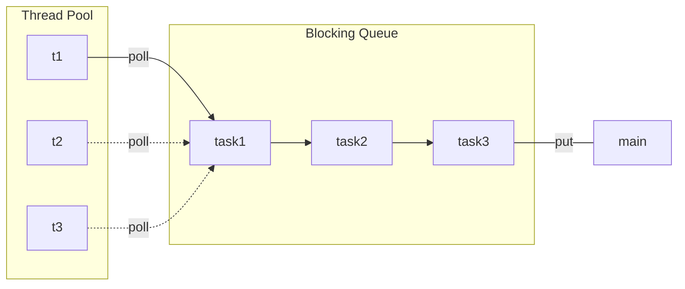
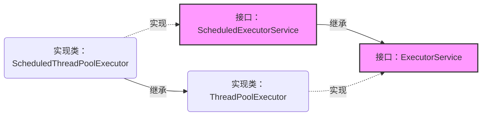
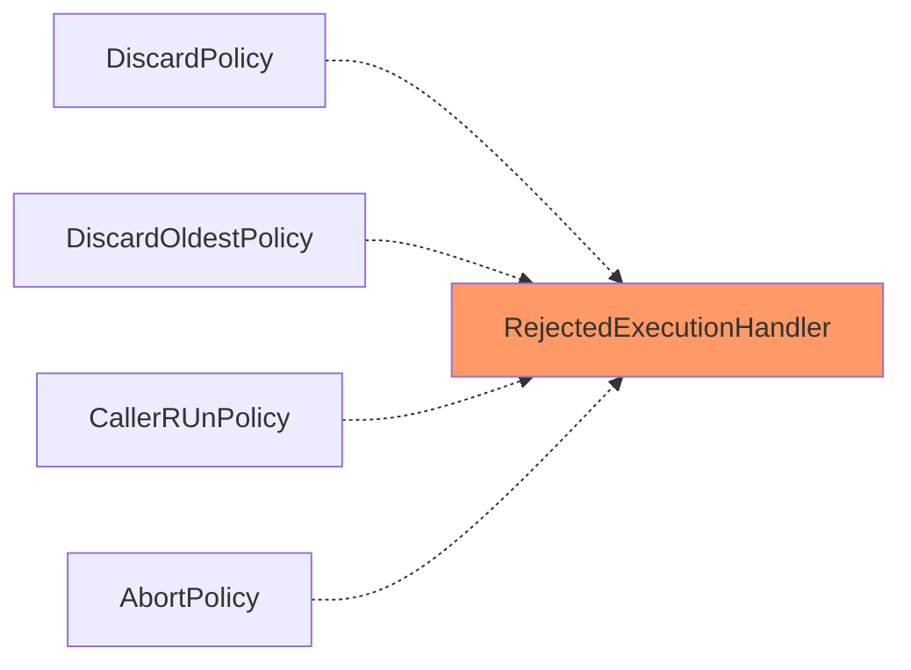
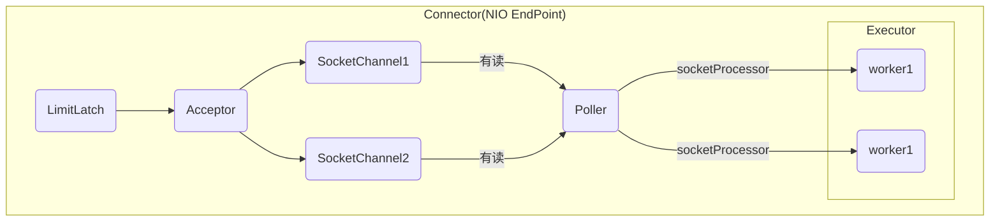
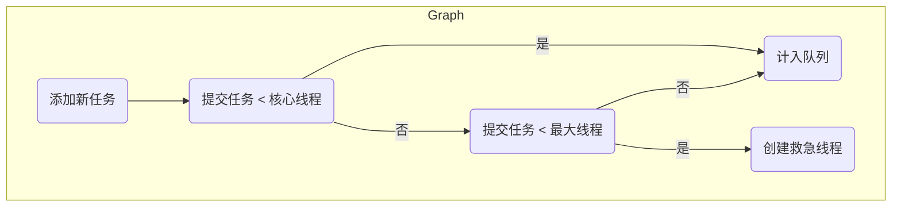
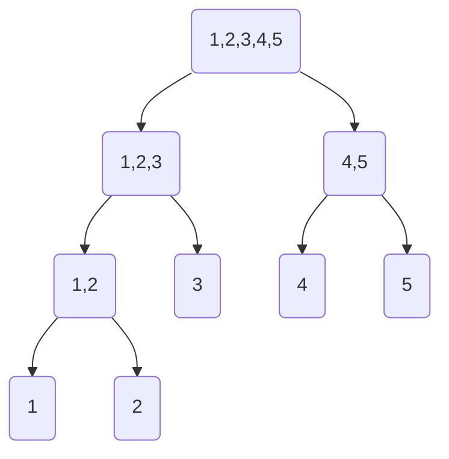

Java并发工具-线程池

### 1、自定义线程池
自定义线程池的思想是基于享元模式，充分利用已经创建的线程，减少内存开销。




生产者消费者模式,任务放在阻塞队列，线程池中的线程处理阻塞队列中的任务。

#### 1.1 take死等和poll超时等待代码
```java
package com.concurrent.p9;

import lombok.extern.slf4j.Slf4j;
import org.junit.Test;

import java.sql.Time;
import java.util.ArrayDeque;
import java.util.Deque;
import java.util.HashSet;
import java.util.concurrent.TimeUnit;
import java.util.concurrent.locks.Condition;
import java.util.concurrent.locks.ReentrantLock;

/**
 * 自定义线程池
 */
@Slf4j(topic = "c.Test_MyThreadPool")
public class Test_MyThreadPool {

    @Test
    public void test_MyThreadPool() {
        MyThreadPool<Task> myThreadPool =
                new MyThreadPool<>(2, 1000, TimeUnit.MILLISECONDS, 5);
        for (int i = 0; i < 5; i++) {
            int j = i;
            myThreadPool.execute(new Task("任务" + j));
        }
        try {
            Thread.sleep(5000);
        } catch (InterruptedException e) {
            e.printStackTrace();
        }
    }
}

/**
 * 线程池实现
 */
@Slf4j(topic = "c.MyThreadPool")
class MyThreadPool<T> {
    //阻塞队列
    private BlockQueue<Task> taskQueue;
    //线程集合
    private HashSet<Worker> workers = new HashSet<>();
    //核心线程数
    private int coreSize;
    //获取任务的超时时间
    private long timeout;
    //时间单位
    private TimeUnit unit;

    public MyThreadPool(int coreSize, long timeout, TimeUnit unit, int capacity) {
        this.coreSize = coreSize;
        this.timeout = timeout;
        this.unit = unit;
        taskQueue = new BlockQueue<>(capacity);
    }

    //执行任务
    public void execute(Task task) {
        synchronized (workers) {
            if (workers.size() < coreSize) {  //如果任务数小于核心数，则直接执行
                Worker worker = new Worker(task);
                log.debug("新增工作线程 {},将要执行 {}", worker, task);
                workers.add(worker);
                worker.start();
            } else {    //如果任务书大于核心数，则放入阻塞队列
                log.debug("{} 加入阻塞队列", task);
                taskQueue.put(task);
            }
        }
    }

    //Work线程对象
    class Worker extends Thread {
        private Task task;

        public Worker(Task task) {
            this.task = task;
        }

        @Override
        public void run() {
            while (task != null || (task = taskQueue.poll(1000, unit)) != null) {
                try {
                    log.debug("正在执行任务 {}", task);
                    task.run();
                } catch (Exception e) {
                    e.printStackTrace();
                } finally {
                    task = null;
                }
            }
            synchronized (workers) {
                log.debug("移除工作线程 {}", this);
                //执行完任务，将工作线程移除
                workers.remove(this);
            }
        }
    }


}

@Slf4j(topic = "c.Task")
class Task implements Runnable {
    private String name;

    public Task(String name) {
        this.name = name;
    }

    @Override
    public String toString() {
        return "Task{" +
                "name='" + name + '\'' +
                '}';
    }

    @Override
    public void run() {
        log.debug("{}", name);
    }
}

/*
 阻塞队列实现
 */
@Slf4j(topic = "c.BlockQueue")
class BlockQueue<T> {
    //1.队列对象
    private Deque<T> queue = new ArrayDeque<>();
    //2.阻塞队列容量
    private int capacity;
    //3.锁
    private ReentrantLock lock = new ReentrantLock();
    //4.阻塞队列为空的条件变量
    private Condition emptyWaitSet = lock.newCondition();
    //5.阻塞队列为满的条件变量
    private Condition fullWaitSet = lock.newCondition();

    public BlockQueue(int capacity) {
        this.capacity = capacity;
    }

    //阻塞获取
    public T take() {
        try {
            lock.lock();
            //如果阻塞队列为空，则等待
            while (queue.size() == 0) {
                try {
                    emptyWaitSet.await();
                } catch (InterruptedException e) {
                    e.printStackTrace();
                }
            }
            //阻塞队列不为空，取出取出一个对象后唤醒生产者线程
            T t = queue.removeFirst();
            fullWaitSet.signal();
            return t;
        } finally {
            lock.unlock();
        }
    }

    //带超时阻塞获取
    public T poll(long timeout, TimeUnit unit) {
        try {
            lock.lock();
            //纳秒
            long nano = unit.toNanos(timeout);
            while (queue.size() == 0) {
                try {
                    if (nano <= 0) {
                        return null;
                    }
                    //awaitNanos方法返回超时时间-经历时间，将返回值再次赋值给nano，可解决虚假唤醒问题
                    nano = emptyWaitSet.awaitNanos(nano);
                } catch (InterruptedException e) {
                    e.printStackTrace();
                }
            }
            T t = queue.removeFirst();
            fullWaitSet.signal();
            return t;
        } finally {
            lock.unlock();
        }
    }

    //阻塞添加
    public void put(T task) {
        try {
            lock.lock();
            //如果阻塞队列满，则等待
            while (queue.size() == capacity) {
                try {
                    fullWaitSet.await();
                } catch (InterruptedException e) {
                    e.printStackTrace();
                }
            }
            //阻塞队列不满，添加后唤醒消费者线程
            queue.addLast(task);
            emptyWaitSet.signal();
        } finally {
            lock.unlock();
        }
    }

    //阻塞队列大小
    public int size() {
        try {
            lock.lock();
            return queue.size();
        } finally {
            lock.unlock();
        }
    }

}
```

> 运行结果

```
14:13:28.765 [main] DEBUG c.MyThreadPool - 新增工作线程 Thread[Thread-0,5,main],将要执行 Task{name='Task--->0'}
14:13:28.790 [main] DEBUG c.MyThreadPool - 新增工作线程 Thread[Thread-1,5,main],将要执行 Task{name='Task--->1'}
14:13:28.790 [main] DEBUG c.BlockQueue - Task{name='Task--->2'} 加入阻塞队列
14:13:28.792 [Thread-0] DEBUG c.MyThreadPool - 正在执行任务 Task{name='Task--->0'}
14:13:28.792 [Thread-1] DEBUG c.MyThreadPool - 正在执行任务 Task{name='Task--->1'}
14:13:33.792 [Thread-1] DEBUG c.Task - Task--->1
14:13:33.792 [Thread-0] DEBUG c.Task - Task--->0
14:13:33.792 [Thread-1] DEBUG c.MyThreadPool - 正在执行任务 Task{name='Task--->2'}
14:13:34.793 [Thread-0] DEBUG c.MyThreadPool - 移除工作线程 Thread[Thread-0,5,main]
14:13:38.794 [Thread-1] DEBUG c.Task - Task--->2
14:13:39.798 [Thread-1] DEBUG c.MyThreadPool - 移除工作线程 Thread[Thread-1,5,main]
```


#### 1.2 当阻塞队列满时，要加入拒绝策略
拒绝策略是通过定义一个函数式接口实现的，利用该接口可以在运行时实现不同的拒绝策略。

##### 策略1：死等

```java
MyThreadPool<Task> myThreadPool =
        new MyThreadPool<>(1, 1000, TimeUnit.MILLISECONDS, 1,
                ((queue, task) -> queue.put(task)));
```

##### 策略2：设置超时等待

```java
MyThreadPool<Task> myThreadPool =
        new MyThreadPool<>(1, 1000, TimeUnit.MILLISECONDS, 1,
                ((queue, task) -> queue.offer(task, 1000, TimeUnit.MILLISECONDS)));
```

##### 策略3：阻塞队列满时放弃

```java
MyThreadPool<Task> myThreadPool =
        new MyThreadPool<>(1, 1000, TimeUnit.MILLISECONDS, 1,
                ((queue, task) -> log.debug("放弃执行任务")));
```

##### 策略4：阻塞队列满时抛出异常

```java
MyThreadPool<Task> myThreadPool =
        new MyThreadPool<>(1, 1000, TimeUnit.MILLISECONDS, 1,
                ((queue, task) -> {
                    throw new RuntimeException("任务执行失败");
                }));
```

##### 策略5：自身调用

```java
MyThreadPool<Task> myThreadPool =
        new MyThreadPool<>(1, 1000, TimeUnit.MILLISECONDS, 1,
                ((queue, task) -> {
                    task.run();
                }));
```

##### 完整的拒绝策略代码

```java
package com.concurrent.p9;

import lombok.extern.slf4j.Slf4j;
import org.junit.Test;

import java.util.ArrayDeque;
import java.util.Deque;
import java.util.HashSet;
import java.util.concurrent.TimeUnit;
import java.util.concurrent.locks.Condition;
import java.util.concurrent.locks.ReentrantLock;

/**
 * 自定义线程池
 */
@Slf4j(topic = "c.Test_MyThreadPool")
public class Test_MyThreadPool {

    @Test
    public void test_MyThreadPool() {
        /**
         * 策略1：死等
         *  MyThreadPool<Task> myThreadPool =
         *                 new MyThreadPool<>(1, 1000, TimeUnit.MILLISECONDS, 1,
         *                         ((queue, task) -> queue.put(task)));
         */
        MyThreadPool<Task> myThreadPool =
                new MyThreadPool<>(1, 1000, TimeUnit.MILLISECONDS, 1,
                        ((queue, task) -> queue.put(task)));

        /**
         * 策略2：带超时等待
         *  MyThreadPool<Task> myThreadPool =
         *                 new MyThreadPool<>(1, 1000, TimeUnit.MILLISECONDS, 1,
         *                         ((queue, task) -> queue.offer(task, 1000, TimeUnit.MILLISECONDS)));
         */

        /**
         * 策略3：放弃任务执行
         *
         *  MyThreadPool<Task> myThreadPool =
         *                 new MyThreadPool<>(1, 1000, TimeUnit.MILLISECONDS, 1,
         *                         ((queue, task) -> log.debug("放弃执行任务")));
         */


        /**
         * 策略4：抛出异常，终止执行
         *MyThreadPool<Task> myThreadPool =
         *                 new MyThreadPool<>(1, 1000, TimeUnit.MILLISECONDS, 1,
         *                         ((queue, task) -> {
         *                             throw new RuntimeException("任务执行失败");
         *                         }));
         */


        /**
         * 策略5：调用者自己执行
         *        MyThreadPool<Task> myThreadPool =
         *                 new MyThreadPool<>(1, 1000, TimeUnit.MILLISECONDS, 1,
         *                         ((queue, task) -> {
         *                             task.run();
         *                         }));
         */


        for (int i = 0; i < 3; i++) {  //3个任务
            myThreadPool.execute(new Task("Task--->" + i));
        }
        try {
            Thread.sleep(50000);
        } catch (InterruptedException e) {
            e.printStackTrace();
        }
    }
}

/**
 * 拒绝策略接口
 */
@FunctionalInterface
interface rejectPolicy<T> {
    void reject(BlockQueue<T> queue, T task);
}

/**
 * 线程池实现
 */
@Slf4j(topic = "c.MyThreadPool")
class MyThreadPool<T> {
    //阻塞队列
    private BlockQueue<Task> taskQueue;
    //线程集合
    private HashSet<Worker> workers = new HashSet<>();
    //核心线程数
    private int coreSize;
    //获取任务的超时时间
    private long timeout;
    //时间单位
    private TimeUnit unit;
    //线程池的拒绝策略
    private rejectPolicy rejectPolicy;


    public MyThreadPool(int coreSize, long timeout, TimeUnit unit, int capacity, rejectPolicy rejectPolicy) {
        this.coreSize = coreSize;
        this.timeout = timeout;
        this.unit = unit;
        taskQueue = new BlockQueue<>(capacity);
        //初始化拒绝策略
        this.rejectPolicy = rejectPolicy;
    }

    //执行任务
    public void execute(Task task) {
        synchronized (workers) {
            if (workers.size() < coreSize) {  //如果任务数小于核心数，则直接执行
                Worker worker = new Worker(task);
                log.debug("新增工作线程 {},将要执行 {}", worker, task);
                workers.add(worker);
                worker.start();
            } else {
                //策略模式，具体操作由调用者实现
                //（1）死等
                //（2）带超时等待
                //（3）放弃任务执行
                //（4）抛出异常
                //（5）让调用者自己执行任务
                taskQueue.tryPut(rejectPolicy, task);
            }
        }
    }

    //Work线程对象
    class Worker extends Thread {
        private Task task;

        public Worker(Task task) {
            this.task = task;
        }

        @Override
        public void run() {
            while (task != null || (task = taskQueue.poll(1000, unit)) != null) {
                try {
                    log.debug("正在执行任务 {}", task);
                    Thread.sleep(5000);  //故意设置长等待时间
                    task.run();
                } catch (Exception e) {
                    e.printStackTrace();
                } finally {
                    task = null;
                }
            }
            synchronized (workers) {
                log.debug("移除工作线程 {}", this);
                workers.remove(this);
            }
        }
    }
}

/**
 * 任务类
 */
@Slf4j(topic = "c.Task")
class Task implements Runnable {
    private String name;

    public Task(String name) {
        this.name = name;
    }

    @Override
    public String toString() {
        return "Task{" +
                "name='" + name + '\'' +
                '}';
    }

    @Override
    public void run() {
        log.debug("{}", name);
    }
}

/*
 阻塞队列实现
 */
@Slf4j(topic = "c.BlockQueue")
class BlockQueue<T> {
    //1.队列对象
    private Deque<T> queue = new ArrayDeque<>();
    //2.阻塞队列容量
    private int capacity;
    //3.锁
    private ReentrantLock lock = new ReentrantLock();
    //4.阻塞队列为空的条件变量
    private Condition emptyWaitSet = lock.newCondition();
    //5.阻塞队列为满的条件变量
    private Condition fullWaitSet = lock.newCondition();

    public BlockQueue(int capacity) {
        this.capacity = capacity;
    }

    //阻塞获取
    public T take() {
        try {
            lock.lock();
            //如果阻塞队列为空，则等待
            while (queue.size() == 0) {
                try {
                    emptyWaitSet.await();
                } catch (InterruptedException e) {
                    e.printStackTrace();
                }
            }
            //阻塞队列不为空，取出取出一个对象后唤醒生产者线程
            T t = queue.removeFirst();
            fullWaitSet.signal();
            return t;
        } finally {
            lock.unlock();
        }
    }

    //带超时阻塞获取
    public T poll(long timeout, TimeUnit unit) {
        try {
            lock.lock();
            //纳秒
            long nano = unit.toNanos(timeout);
            while (queue.size() == 0) {
                try {
                    if (nano <= 0) {
                        return null;
                    }
                    //awaitNanos方法返回超时时间-经历时间，将返回值再次赋值给nano，可解决虚假唤醒问题
                    nano = emptyWaitSet.awaitNanos(nano);
                } catch (InterruptedException e) {
                    e.printStackTrace();
                }
            }
            T t = queue.removeFirst();
            fullWaitSet.signal();
            return t;
        } finally {
            lock.unlock();
        }
    }

    //阻塞添加
    public void put(T task) {
        try {
            lock.lock();
            //如果阻塞队列满，则等待
            while (queue.size() == capacity) {
                try {
                    log.debug("阻塞队列已满，等待加入...");
                    fullWaitSet.await();
                } catch (InterruptedException e) {
                    e.printStackTrace();
                }
            }
            //阻塞队列不满，添加后唤醒消费者线程
            queue.addLast(task);
            emptyWaitSet.signal();
        } finally {
            lock.unlock();
        }
    }

    //带超时阻塞添加
    public boolean offer(T task, long timeout, TimeUnit unit) {
        try {
            lock.lock();
            long nano = unit.toNanos(timeout);
            while (queue.size() == capacity) {
                try {
                    if (nano <= 0) {
                        log.debug("{}添加阻塞队列失败", task);
                        return false;
                    }
                    log.debug("等待加入任务队列 {}", task);
                    nano = fullWaitSet.awaitNanos(nano);
                } catch (InterruptedException e) {
                    e.printStackTrace();
                }
            }
            log.debug("{} 加入阻塞队列", task);
            queue.addLast(task);
            emptyWaitSet.signal();
            return true;
        } finally {
            lock.unlock();
        }
    }

    //阻塞队列大小
    public int size() {
        try {
            lock.lock();
            return queue.size();
        } finally {
            lock.unlock();
        }
    }

    public void tryPut(rejectPolicy<T> rejectPolicy, T task) {
        lock.lock();
        try {
            //判断队列是否满
            if (queue.size() == capacity) {
                rejectPolicy.reject(this, task);  //队列满时的策略
            } else {  //有空闲将任务加入阻塞队列
                log.debug("{} 加入阻塞队列", task);
                queue.addLast(task);
                emptyWaitSet.signal();
            }
        } finally {
            lock.unlock();
        }
    }
}
```

### 2、ThreadPoolExecutor



- ExecutorService：线程池最基本的接口
- ScheduleExecutorService：扩展的接口，添加了任务调度的功能，定时执行任务
- ThreadPoolExecutor：ExecutorService接口的基本实现
- ScheduleThreadPoolExecutor：ScheduleExecutorService的实现

#### 2.1 线程池状态
ThreadPoolExecutor 使用 int 的高 3 位来表示线程池状态，低 29 位表示线程数量。

| 状态名     | 高3位 | 接收新任务 | 处理阻塞队列 | 说明                                                  |
| ---------- | ----- | ---------- | ------------ | ----------------------------------------------------- |
| RUNNING    | 111   | 是         | 是           | 第一个1代表符号位，是负数                             |
| SHUTDOWN   | 000   | 否         | 是           | 不会接收新任务，但会处理阻塞队列剩余任务              |
| STOP       | 001   | 否         | 否           | 会中断（interrupt）正在执行的任务，并抛弃阻塞队列任务 |
| TIDYING    | 010   | -          | -            | 任务全执行完毕，活动线程为 0 即将进入终结             |
| TERMINATED | 011   | -          | -            | 终结状态                                              |

从数字上比较，TERMINATED > TIDYING > STOP > SHUTDOWN > RUNNING。
这些信息存储在一个原子变量 ctl 中，目的是将线程池状态与线程个数合二为一，这样就可以用一次 cas 原子操作
进行赋值 。

```java
// c 为旧值， ctlOf 返回结果为新值
ctl.compareAndSet(c, ctlOf(targetState, workerCountOf(c))));
// rs 为高 3 位代表线程池状态， wc 为低 29 位代表线程个数，ctl 是合并它们
private static int ctlOf(int rs, int wc) { return rs | wc; }
```

#### 2.2 构造方法

```java
public ThreadPoolExecutor(int corePoolSize,
						int maximumPoolSize,
						long keepAliveTime,
						TimeUnit unit,
						BlockingQueue<Runnable> workQueue,
						ThreadFactory threadFactory,
						RejectedExecutionHandler handler)
```

- corePoolSize 核心线程数目 (最多保留的线程数)
- maximumPoolSize 最大线程数目
- keepAliveTime 生存时间 - 针对救急线程
- unit 时间单位 - 针对救急线程
- workQueue 阻塞队列
- threadFactory 线程工厂 - 可以为线程创建时起个好名字
-  handler 拒绝策略  

当阻塞队列装满任务时，如果还有任务，则把它交给救急线程处理，如果此时还有任务则会执行拒绝策略：

```mermaid
flowchart TB
subgraph 阻塞队列
size=2
t3(任务3)
t4(任务4)
end
subgraph 线程池c=2,m=3
ct1(核心线程1)
ct1-->t1(任务1)
ct2(核心线程2)
ct2-->t2(任务2)
mt1(救急线程1)
mt1-->t5(任务5)
end

style ct1 fill:#ccf,stroke:#f66,stroke-width:2px
style ct2 fill:#ccf,stroke:#f66,stroke-width:2px
style mt1 fill:#ccf,stroke:#f66,stroke-width:2px
```

当救急线程处理完任务后，救急线程会被销毁，救急线程有生存时间，核心线程没有生存时间，会一直存在：

```mermaid
flowchart TB
subgraph 阻塞队列
size=2
t3(任务3)
t4(任务4)
end
subgraph 线程池c=2,m=3
ct1(核心线程1)
ct1-->t1(任务1)
ct2(核心线程2)
ct2-->t2(任务2)
mt1(救急线程1)
end

style ct1 fill:#ccf,stroke:#f66,stroke-width:2px
style ct2 fill:#ccf,stroke:#f66,stroke-width:2px
style mt1 fill:#ccf,stroke:#f66,stroke-width:2px,stroke-dasharray:5,5
```

- 线程池中刚开始没有线程，当一个任务提交给线程池后，线程池会创建一个新线程来执行任务。
- 当线程数达到 corePoolSize 并没有线程空闲，这时再加入任务，新加的任务会被加入workQueue 队列排队，直到有空闲的线程。
- 如果队列选择了有界队列，那么任务超过了队列大小时，会创建 maximumPoolSize - corePoolSize 数目的线程来救急。
- 如果线程到达 maximumPoolSize 仍然有新任务这时会执行拒绝策略。拒绝策略 jdk 提供了 4 种实现，其它著名框架也提供了实现：
	- AbortPolicy 让调用者抛出 RejectedExecutionException 异常，这是默认策略  
	- CallerRunsPolicy 让调用者运行任务
	- DiscardPolicy 放弃本次任务
	- DiscardOldestPolicy 放弃队列中最早的任务，本任务取而代之
	- Dubbo 的实现，在抛出 RejectedExecutionException 异常之前会记录日志，并 dump 线程栈信息，方便定位问题。
	- Netty 的实现，是创建一个新线程来执行任务。
	- ActiveMQ 的实现，带超时等待（60s）尝试放入队列，类似我们之前自定义的拒绝策略。
	- PinPoint 的实现，它使用了一个拒绝策略链，会逐一尝试策略链中每种拒绝策略 。
- 当高峰过去后，超过corePoolSize 的救急线程如果一段时间没有任务做，需要结束节省资源，这个时间由
keepAliveTime 和 unit 来控制。  




根据这个构造方法，JDK `Executors类`中提供了众多工厂方法来创建各种用途的线程池  。


#### 2.3 newFixedThreadPool
```java
public static ExecutorService newFixedThreadPool(int nThreads) {
    //nThreads=nThreads  核心线程=最大线程，没有救急线程
    //0L, TimeUnit.MILLISECONDS,不需要超时时间
    //new LinkedBlockingQueue<Runnable>() ，可以放任意多的任务
	return new ThreadPoolExecutor(nThreads, nThreads,
								0L, TimeUnit.MILLISECONDS,
								new LinkedBlockingQueue<Runnable>());
}
```

> 特点

- 核心线程数 == 最大线程数（没有救急线程被创建），因此也无需超时时间
- 阻塞队列是无界的，可以放任意数量的任务  

> 评价

适用于任务量已知，比较耗时的任务


##### 2.3.1 默认工厂方法的newFixedThreadPool 

```java
 @Test
    public void test_newFixedThreadPool_DefaultThreadFactory() {
        ExecutorService pool = Executors.newFixedThreadPool(2);
        //任务1
        pool.execute(() -> {
            try {
                log.debug("1");
                Thread.sleep(new Random().nextInt(5000));
            } catch (InterruptedException e) {
                e.printStackTrace();
            }
        });
        //任务2
        pool.execute(() -> {
            try {
                log.debug("2");
                Thread.sleep(new Random().nextInt(5000));
            } catch (InterruptedException e) {
                e.printStackTrace();
            }
        });
        //任务3
        pool.execute(() -> {
            try {
                log.debug("3");
                Thread.sleep(new Random().nextInt(5000));
            } catch (InterruptedException e) {
                e.printStackTrace();
            }
        });
        //任务4
        pool.execute(() -> {
            try {
                log.debug("4");
                Thread.sleep(new Random().nextInt(5000));
            } catch (InterruptedException e) {
                e.printStackTrace();
            }
        });

        while (true) ;
    }
```

> 运行结果

```
14:19:24.788 [pool-1-thread-1] DEBUG c.Test_ThreadPoolExecutor - 1
14:19:24.787 [pool-1-thread-2] DEBUG c.Test_ThreadPoolExecutor - 2
14:19:28.328 [pool-1-thread-2] DEBUG c.Test_ThreadPoolExecutor - 3
14:19:29.438 [pool-1-thread-1] DEBUG c.Test_ThreadPoolExecutor - 4
```


创建线程的工厂方法：

```java
/**
     * The default thread factory
     */
    static class DefaultThreadFactory implements ThreadFactory {
        private static final AtomicInteger poolNumber = new AtomicInteger(1);
        private final ThreadGroup group;
        private final AtomicInteger threadNumber = new AtomicInteger(1);
        private final String namePrefix;

        DefaultThreadFactory() {
            SecurityManager s = System.getSecurityManager();
            group = (s != null) ? s.getThreadGroup() :
                                  Thread.currentThread().getThreadGroup();
            //线程名称前缀
            namePrefix = "pool-" +
                          poolNumber.getAndIncrement() +
                         "-thread-";
        }

        public Thread newThread(Runnable r) {
            Thread t = new Thread(group, r,
                                  namePrefix + threadNumber.getAndIncrement(),
                                  0);
            if (t.isDaemon())
                t.setDaemon(false);  //线程池中的线程是非守护线程，不会随着主线程结束而结束
            if (t.getPriority() != Thread.NORM_PRIORITY)
                t.setPriority(Thread.NORM_PRIORITY);
            return t;
        }
    }
```


##### 2.3.2自定义工厂的newFixedThreadPool

```java
 @Test
    public void test_newFixedThreadPool_MyThreadFactory() {
        //自定义线程工厂
        ExecutorService pool = Executors.newFixedThreadPool(2, new ThreadFactory() {
            private AtomicInteger t = new AtomicInteger(0);

            @Override
            public Thread newThread(Runnable r) {
                return new Thread(r, "mypool-" + t.getAndIncrement());
            }
        });
        //任务1
        pool.execute(() -> {
            try {
                log.debug("1");
                Thread.sleep(new Random().nextInt(5000));
            } catch (InterruptedException e) {
                e.printStackTrace();
            }
        });
        //任务2
        pool.execute(() -> {
            try {
                log.debug("2");
                Thread.sleep(new Random().nextInt(5000));
            } catch (InterruptedException e) {
                e.printStackTrace();
            }
        });
        //任务3
        pool.execute(() -> {
            try {
                log.debug("3");
                Thread.sleep(new Random().nextInt(5000));
            } catch (InterruptedException e) {
                e.printStackTrace();
            }
        });
        //任务4
        pool.execute(() -> {
            try {
                log.debug("4");
                Thread.sleep(new Random().nextInt(5000));
            } catch (InterruptedException e) {
                e.printStackTrace();
            }
        });

        while (true) ;
    }
```

> 运行结果
```
14:18:25.767 [mypool-0] DEBUG c.Test_ThreadPoolExecutor - 1
14:18:25.775 [mypool-1] DEBUG c.Test_ThreadPoolExecutor - 2
14:18:28.982 [mypool-0] DEBUG c.Test_ThreadPoolExecutor - 3
14:18:29.694 [mypool-1] DEBUG c.Test_ThreadPoolExecutor - 4
```

#### 2.4 newCachedThreadPool

```java
public static ExecutorService newCachedThreadPool() {
    return new ThreadPoolExecutor(0, Integer.MAX_VALUE,
                                  60L, TimeUnit.SECONDS,
                                  new SynchronousQueue<Runnable>());
}
```

> 特点

- 核心线程数是 0， 最大线程数是 Integer.MAX_VALUE，救急线程的空闲生存时间是 60s，意味着：
	- 全部都是救急线程（60s 后可以回收）
	- 救急线程可以无限创建

- 队列采用了 SynchronousQueue 实现特点是，它没有容量，没有线程来取是放不进去的（一手交钱、一手交货）。

> 评价

整个线程池表现为线程数会根据任务量不断增长，没有上限，当任务执行完毕，空闲 1分钟后释放线程。 适合任务数比较密集，但每个任务执行时间较短的情况。

> SynchronousQueue代码演示

```java
@Test
    public void test_SynchronousQueue() {
        SynchronousQueue<Integer> integers = new SynchronousQueue<>();
        //线程1
        new Thread(() -> {
            try {
                log.debug("putting {} ", 1);  //put后会阻塞
                integers.put(1);
                log.debug("{} putted...", 1);
                log.debug("putting...{} ", 2);  ////put后会阻塞
                integers.put(2);
                log.debug("{} putted...", 2);
            } catch (InterruptedException e) {
                e.printStackTrace();
            }
        }, "t1").start();

        try {
            Thread.sleep(1000);
        } catch (InterruptedException e) {
            e.printStackTrace();
        }

        new Thread(() -> {
            try {
                log.debug("taking {}", 1);
                integers.take();
            } catch (InterruptedException e) {
                e.printStackTrace();
            }
        }, "t2").start();

        try {
            Thread.sleep(1000);
        } catch (InterruptedException e) {
            e.printStackTrace();
        }

        new Thread(() -> {
            try {
                log.debug("taking {}", 2);
                integers.take();
            } catch (InterruptedException e) {
                e.printStackTrace();
            }
        }, "t3").start();
    }
```

> 运行结果
```
13:49:31.021 [t1] DEBUG c.Test_ThreadPoolExecutor - putting 1 
13:49:32.017 [t2] DEBUG c.Test_ThreadPoolExecutor - taking 1
13:49:32.018 [t1] DEBUG c.Test_ThreadPoolExecutor - 1 putted...
13:49:32.018 [t1] DEBUG c.Test_ThreadPoolExecutor - putting...2 
13:49:33.020 [t3] DEBUG c.Test_ThreadPoolExecutor - taking 2
13:49:33.021 [t1] DEBUG c.Test_ThreadPoolExecutor - 2 putted...
```


> newCachedThreadPool代码演示

```java
@Test
    public void test_newCachedThreadPool() {
        //默认线程工厂
        ExecutorService pool = Executors.newCachedThreadPool();
        //任务1
        pool.execute(() -> {
            try {
                log.debug("1");
                Thread.sleep(new Random().nextInt(5000));
            } catch (InterruptedException e) {
                e.printStackTrace();
            }
        });
        //任务2
        pool.execute(() -> {
            try {
                log.debug("2");
                Thread.sleep(new Random().nextInt(5000));
            } catch (InterruptedException e) {
                e.printStackTrace();
            }
        });
        //任务3
        pool.execute(() -> {
            try {
                log.debug("3");
                Thread.sleep(new Random().nextInt(5000));
            } catch (InterruptedException e) {
                e.printStackTrace();
            }
        });
        //任务4
        pool.execute(() -> {
            try {
                log.debug("4");
                Thread.sleep(new Random().nextInt(5000));
            } catch (InterruptedException e) {
                e.printStackTrace();
            }
        });

        while (true) ;
    }
```

> 运行结果

```
13:54:42.199 [pool-1-thread-1] DEBUG c.Test_ThreadPoolExecutor - 1
13:54:42.199 [pool-1-thread-2] DEBUG c.Test_ThreadPoolExecutor - 2
13:54:42.199 [pool-1-thread-3] DEBUG c.Test_ThreadPoolExecutor - 3
13:54:42.199 [pool-1-thread-4] DEBUG c.Test_ThreadPoolExecutor - 4
```


####  2.5 newSingleThreadExecutor

```java
    public static ExecutorService newSingleThreadExecutor() {
        return new FinalizableDelegatedExecutorService
            (new ThreadPoolExecutor(1, 1,
                                    0L, TimeUnit.MILLISECONDS,
                                    new LinkedBlockingQueue<Runnable>()));
    }
```

newSingleThreadExecutor使用场景：
希望多个任务排队执行。线程数固定为 1，任务数多于 1 时，会放入无界队列排队。任务执行完毕，这唯一的线程也不会被释放。

> 区别

- 自己创建一个单线程串行执行任务，如果任务执行失败而终止那么没有任何补救措施，而线程池还会新建一个线程，保证池的正常工作。
- Executors.newSingleThreadExecutor() 线程个数始终为1，不能修改。
	- FinalizableDelegatedExecutorService 应用的是`装饰器模式`，只对外暴露了 ExecutorService 接口，因此不能调用 ThreadPoolExecutor 中特有的方法。
- Executors.newFixedThreadPool(1) 初始时为1，以后还可以修改。
	- 对外暴露的是 ThreadPoolExecutor 对象，可以强转后调用 setCorePoolSize 等方法进行修改。


> newSingleThreadExecutor演示代码

```java
  @Test
    public void test_newSingleThreadExecutor() {
        ExecutorService pool = Executors.newSingleThreadExecutor();
        //虽然在执行任务过程中产生了异常，但是不会终止其他任务的执行
        pool.execute(() -> {
            log.debug("1");
            int i = 1 / 0;   //产生错误，抛出异常
        });

        pool.execute(() -> {
            log.debug("2");
        });

        pool.execute(() -> {
            log.debug("3");
        });
        while (true) ;
    }
```

> 运行结果
```
14:07:12.030 [pool-1-thread-1] DEBUG c.Test_ThreadPoolExecutor - 1
Exception in thread "pool-1-thread-1" java.lang.ArithmeticException: / by zero
	at com.concurrent.p9.Test_ThreadPoolExecutor.lambda$test_newSingleThreadExecutor$15(Test_ThreadPoolExecutor.java:205)
	at java.util.concurrent.ThreadPoolExecutor.runWorker(ThreadPoolExecutor.java:1142)
	at java.util.concurrent.ThreadPoolExecutor$Worker.run(ThreadPoolExecutor.java:617)
	at java.lang.Thread.run(Thread.java:748)
14:07:12.042 [pool-1-thread-2] DEBUG c.Test_ThreadPoolExecutor - 2
14:07:12.043 [pool-1-thread-2] DEBUG c.Test_ThreadPoolExecutor - 3
```

#### 2.6 提交任务

```java
// 执行任务
void execute(Runnable command);
// 提交任务 task，用返回值 Future 获得任务执行结果
<T> Future<T> submit(Callable<T> task);
// 提交 tasks 中所有任务
<T> List<Future<T>> invokeAll(Collection<? extends Callable<T>> tasks)
					throws InterruptedException;
// 提交 tasks 中所有任务，带超时时间
<T> List<Future<T>> invokeAll(Collection<? extends Callable<T>> tasks,
								long timeout, TimeUnit unit)
					throws InterruptedException;
// 提交 tasks 中所有任务，哪个任务先成功执行完毕，返回此任务执行结果，其它任务取消
<T> T invokeAny(Collection<? extends Callable<T>> tasks)
	throws InterruptedException, ExecutionException;
// 提交 tasks 中所有任务，哪个任务先成功执行完毕，返回此任务执行结果，其它任务取消，带超时时间
<T> T invokeAny(Collection<? extends Callable<T>> tasks,
				long timeout, TimeUnit unit)
		throws InterruptedException, ExecutionException, TimeoutException;
```

> submit代码演示

```java
    @Test
    public void test_submit() throws ExecutionException, InterruptedException {
        ExecutorService pool = Executors.newFixedThreadPool(1);
        Future<String> result = pool.submit(() -> {
            Thread.sleep(new Random().nextInt(5000));
            //返回字符串结果
            return "OK";
        });
        //在主线程中获取返回结果
        log.debug("返回结果：{}", result.get());
    }
```

> 运行结果

```
14:44:17.082 [main] DEBUG c.Test_ThreadPoolExecutor - 返回结果：OK
```


> Callable接口

```java
@FunctionalInterface
public interface Callable<V> {
    /**
     * Computes a result, or throws an exception if unable to do so.
     *
     * @return computed result
     * @throws Exception if unable to compute a result
     */
    V call() throws Exception;
}
```


> invokeAll代码演示

```java
    @Test
    public void test_invokeAll() throws InterruptedException {
        ExecutorService pool = Executors.newFixedThreadPool(1);
        List<Future<String>> futures = pool.invokeAll(Arrays.asList(
                () -> {
                    log.debug("1");
                    return "task-1";
                },
                () -> {
                    log.debug("2");
                    return "task-2";
                },
                () -> {
                    log.debug("3");
                    return "task-3";
                }
        ));
        //查看所有任务的返回结果
        futures.forEach((s) -> {
            try {
                log.debug(s.get());
            } catch (InterruptedException e) {
                e.printStackTrace();
            } catch (ExecutionException e) {
                e.printStackTrace();
            }
        });
    }
```

> 运行结果

```
14:53:39.765 [pool-1-thread-1] DEBUG c.Test_ThreadPoolExecutor - 1
14:53:39.768 [pool-1-thread-1] DEBUG c.Test_ThreadPoolExecutor - 2
14:53:39.768 [pool-1-thread-1] DEBUG c.Test_ThreadPoolExecutor - 3
14:53:39.769 [main] DEBUG c.Test_ThreadPoolExecutor - task-1
14:53:39.769 [main] DEBUG c.Test_ThreadPoolExecutor - task-2
14:53:39.769 [main] DEBUG c.Test_ThreadPoolExecutor - task-3
```


> invokeAny 代码演示
```java
    @Test
    public void test_invokeAny() throws ExecutionException, InterruptedException {
        ExecutorService pool = Executors.newFixedThreadPool(1);
        //谁先执行完就返回谁的结果
        Object any = pool.invokeAny(Arrays.asList(
                () -> {
                    log.debug("1");
                    return "task-1";
                },
                () -> {
                    log.debug("2");
                    return "task-2";
                },
                () -> {
                    log.debug("3");
                    return "task-3";
                }
        ));
        //查看返回结果
        log.debug("返回结果：{}", (String) any);
    }
```

> 运行结果
```
15:01:30.847 [pool-1-thread-1] DEBUG c.Test_ThreadPoolExecutor - 1
15:01:30.850 [main] DEBUG c.Test_ThreadPoolExecutor - 返回结果：task-1
```


#### 2.7 关闭线程池

##### shutdown

```java
/*
线程池状态变为 SHUTDOWN
- 不会接收新任务
- 但已提交任务会执行完
- 此方法不会阻塞调用线程的执行
*/
void shutdown();
```

```java
public void shutdown() {
    final ReentrantLock mainLock = this.mainLock;
    mainLock.lock();
    try {
        checkShutdownAccess();
        // 修改线程池状态
        advanceRunState(SHUTDOWN);
        // 仅会打断空闲线程
        interruptIdleWorkers();
        onShutdown(); // 扩展点 ScheduledThreadPoolExecutor
    } finally {
    	mainLock.unlock();
    }
    // 尝试终结(没有运行的线程可以立刻终结，如果还有运行的线程也不会等)
    tryTerminate();
}
```


> shutdown演示代码（shutdown之后再执行任务会抛出异常）

```java
    @Test
    public void test_shutdown() {
        ExecutorService pool = Executors.newFixedThreadPool(2);
        Future<Integer> result1 = pool.submit(() -> {
            try {
                log.debug("task 1 running...");
                Thread.sleep(1000);
                log.debug("task 1 finished...");
            } catch (InterruptedException e) {
                e.printStackTrace();
            }
            return 1;
        });
        Future<Integer> result2 = pool.submit(() -> {
            try {
                log.debug("task 2 running...");
                Thread.sleep(1000);
                log.debug("task 2 finished...");
            } catch (InterruptedException e) {
                e.printStackTrace();
            }
            return 2;
        });
        Future<Integer> result3 = pool.submit(() -> {
            try {
                log.debug("task 3 running...");
                Thread.sleep(1000);
                log.debug("task 3 finished...");
            } catch (InterruptedException e) {
                e.printStackTrace();
            }
            return 3;
        });
        //调用shutdown方法
        log.debug("shutdown...");
        pool.shutdown();
        log.debug("other...");

        //如果在shutdown之后再执行任务，会抛出异常
        Future<Integer> result4 = pool.submit(() -> {
            try {
                log.debug("task 4 running...");
                Thread.sleep(1000);
                log.debug("task 4 finished...");
            } catch (InterruptedException e) {
                e.printStackTrace();
            }
            return 4;
        });
    }
```

> 运行结果

```
#主线程调用pool.shutdown();
20:15:10.354 [main] DEBUG c.Test_ThreadPoolStatus - shutdown...
#线程2执行任务2
20:15:10.354 [pool-1-thread-2] DEBUG c.Test_ThreadPoolStatus - task 2 running...
#当主线程调用完shutdown后，还会执行主线程剩余代码
20:15:10.357 [main] DEBUG c.Test_ThreadPoolStatus - other...
#线程1执行任务1
20:15:10.354 [pool-1-thread-1] DEBUG c.Test_ThreadPoolStatus - task 1 running...
#抛出RejectedExecutionException 异常，线程池使用拒绝策略
java.util.concurrent.RejectedExecutionException: Task java.util.concurrent.FutureTask@44e81672 rejected from java.util.concurrent.ThreadPoolExecutor@60215eee[Shutting down, pool size = 2, active threads = 2, queued tasks = 1, completed tasks = 0]

```

> shutdown演示（shutdown之后，其他任务还是会继续执行）

```java
    @Test
    public void test_shutdown() {
        ExecutorService pool = Executors.newFixedThreadPool(2);
        Future<Integer> result1 = pool.submit(() -> {
            try {
                log.debug("task 1 running...");
                Thread.sleep(1000);
                log.debug("task 1 finished...");
            } catch (InterruptedException e) {
                e.printStackTrace();
            }
            return 1;
        });
        Future<Integer> result2 = pool.submit(() -> {
            try {
                log.debug("task 2 running...");
                Thread.sleep(1000);
                log.debug("task 2 finished...");
            } catch (InterruptedException e) {
                e.printStackTrace();
            }
            return 2;
        });
        Future<Integer> result3 = pool.submit(() -> {
            try {
                log.debug("task 3 running...");
                Thread.sleep(1000);
                log.debug("task 3 finished...");
            } catch (InterruptedException e) {
                e.printStackTrace();
            }
            return 3;
        });
        //调用shutdown方法
        log.debug("shutdown...");
        pool.shutdown();
        log.debug("other...");


        while (true) ;
    }
```

> 运行结果

```
#主线成调用完pool.shudown()后，如果不抛出异常，当前任务和阻塞队列中的任务会执行完成
20:22:54.266 [main] DEBUG c.Test_ThreadPoolStatus - shutdown...
20:22:54.266 [pool-1-thread-2] DEBUG c.Test_ThreadPoolStatus - task 2 running...
20:22:54.266 [pool-1-thread-1] DEBUG c.Test_ThreadPoolStatus - task 1 running...
20:22:54.268 [main] DEBUG c.Test_ThreadPoolStatus - other...
20:22:55.269 [pool-1-thread-1] DEBUG c.Test_ThreadPoolStatus - task 1 finished...
20:22:55.305 [pool-1-thread-1] DEBUG c.Test_ThreadPoolStatus - task 3 running...
20:22:55.306 [pool-1-thread-2] DEBUG c.Test_ThreadPoolStatus - task 2 finished...
20:22:56.306 [pool-1-thread-1] DEBUG c.Test_ThreadPoolStatus - task 3 finished...
```


##### shutdownNow（暴力停止）

```java
/*
线程池状态变为 STOP
- 不会接收新任务
- 会将队列中的任务返回
- 并用 interrupt 的方式中断正在执行的任务
*/
List<Runnable> shutdownNow();
```

```java
public List<Runnable> shutdownNow() {
    List<Runnable> tasks;
    final ReentrantLock mainLock = this.mainLock;
    mainLock.lock();
    try {
        checkShutdownAccess();
        // 修改线程池状态
        advanceRunState(STOP);
        // 打断所有线程
        interruptWorkers();
        // 获取队列中剩余任务
        tasks = drainQueue();
    } finally {
    	mainLock.unlock();
    }
    // 尝试终结
    tryTerminate();
    return tasks;
}
```

其他方法

```java
// 不在 RUNNING 状态的线程池，此方法就返回 true
boolean isShutdown();
// 线程池状态是否是 TERMINATED
boolean isTerminated();
// 调用 shutdown 后，由于调用线程并不会等待所有任务运行结束，因此如果它想在线程池 TERMINATED 后做些事情，可以利用此方法等待
boolean awaitTermination(long timeout, TimeUnit unit) throws 				InterruptedException;
```


> shutdownNow 代码演示

```java
 @Test
    public void test_shutdownNow() {
        ExecutorService pool = Executors.newFixedThreadPool(1);
        Future<Integer> result1 = pool.submit(() -> {
            try {
                log.debug("task 1 running...");
                Thread.sleep(1000);
                log.debug("task 1 finished...");
            } catch (InterruptedException e) {
                e.printStackTrace();
            }
            return 1;
        });
        Future<Integer> result2 = pool.submit(() -> {
            try {
                log.debug("task 2 running...");
                Thread.sleep(1000);
                log.debug("task 2 finished...");
            } catch (InterruptedException e) {
                e.printStackTrace();
            }
            return 2;
        });
        Future<Integer> result3 = pool.submit(() -> {
            try {
                log.debug("task 3 running...");
                Thread.sleep(1000);
                log.debug("task 3 finished...");
            } catch (InterruptedException e) {
                e.printStackTrace();
            }
            return 3;
        });
        //队列中没有执行的任务会返回
        log.debug("shutdownNow...");
        List<Runnable> runnables = pool.shutdownNow();
        runnables.forEach((s) -> log.debug("任务：" + s));
        log.debug("other...");
        while (true) ;
    }
```

> 运行结果

```
20:30:59.266 [main] DEBUG c.Test_ThreadPoolStatus - shutdownNow...
20:30:59.273 [main] DEBUG c.Test_ThreadPoolStatus - 任务：java.util.concurrent.FutureTask@7bfcd12c
20:30:59.274 [main] DEBUG c.Test_ThreadPoolStatus - 任务：java.util.concurrent.FutureTask@42f30e0a
20:30:59.274 [main] DEBUG c.Test_ThreadPoolStatus - other...
20:30:59.277 [pool-1-thread-1] DEBUG c.Test_ThreadPoolStatus - task 1 running...
java.lang.InterruptedException: sleep interrupted
```


#### 异步模式-工作线程

##### 1、定义

让有限的工作线程（Worker Thread）来轮流异步处理无限多的任务。也可以将其归类为分工模式，它的典型实现就是线程池，也体现了经典设计模式中的享元模式。
例如，海底捞的服务员（线程），轮流处理每位客人的点餐（任务），如果为每位客人都配一名专属的服务员，那么成本就太高了（对比另一种多线程设计模式：Thread-Per-Message）注意，不同任务类型应该使用不同的线程池，这样能够避免饥饿，并能提升效率例如，如果一个餐馆的工人既要招呼客人（任务类型A），又要到后厨做菜（任务类型B）显然效率不咋地，分成服务员（线程池A）与厨师（线程池B）更为合理，当然你能想到更细致的分工。

##### 2、饥饿

固定大小的线程池会有饥饿现象
- 两个工人是同一个线程池中的两个线程
- 他们要做的事情是：为客人点餐和到后厨做菜，这是两个阶段的工作
	- 客人点餐：必须先点完餐，等菜做好，上菜，在此期间处理点餐的工人必须等待
	- 后厨做菜：没啥说的，做就是了
- 比如工人A 处理了点餐任务，接下来它要等着 工人B 把菜做好，然后上菜，他俩也配合的蛮好
- 但现在同时来了两个客人，这个时候工人A 和工人B 都去处理点餐了，这时没人做饭了，饥饿

> 线程不足引起的饥饿代码演示

> 1个线程点餐，1个线程做菜不会产生饥饿

```java
@Test
    public void test_starvation() {
        ExecutorService pool = Executors.newFixedThreadPool(2);
        //1个线程点餐，1个线程做菜，不会饥饿
        pool.execute(() -> {
            log.debug("开始点餐");
            Future<String> future = pool.submit(() -> {
                log.debug("做菜...");
                return cooking();
            });
            try {
                log.debug("上菜:{}", future.get());
            } catch (InterruptedException e) {
                e.printStackTrace();
            } catch (ExecutionException e) {
                e.printStackTrace();
            }
        });

        while (true) ;
    }
```


> 运行结果

```
20:56:45.524 [pool-1-thread-1] DEBUG c.Test_ThreadPoolStarvation - 开始点餐
20:56:45.564 [pool-1-thread-2] DEBUG c.Test_ThreadPoolStarvation - 做菜...
20:56:45.564 [pool-1-thread-1] DEBUG c.Test_ThreadPoolStarvation - 上菜:地三鲜
```

> 当执行两个点餐时，2个线程都跑去点餐，没有线程做饭，产生饥饿

```java
static final List<String> MENU = Arrays.asList("地三鲜", "辣子鸡", "可乐");
    static Random RANDOM = new Random();

    static String cooking() {
        return MENU.get(RANDOM.nextInt(MENU.size()));
    }
    
@Test
    public void test_starvation() {
        ExecutorService pool = Executors.newFixedThreadPool(2);
        //1个线程点餐，1个线程做菜，不会饥饿
        pool.execute(() -> {
            log.debug("开始点餐");
            Future<String> future = pool.submit(() -> {
                log.debug("做菜...");
                return cooking();
            });
            try {
                log.debug("上菜:{}", future.get());
            } catch (InterruptedException e) {
                e.printStackTrace();
            } catch (ExecutionException e) {
                e.printStackTrace();
            }
        });

        pool.execute(() -> {
            log.debug("开始点餐");
            Future<String> future = pool.submit(() -> {
                log.debug("做菜...");
                return cooking();
            });
            try {
                log.debug("上菜:{}", future.get());
            } catch (InterruptedException e) {
                e.printStackTrace();
            } catch (ExecutionException e) {
                e.printStackTrace();
            }
        });

        while (true) ;
    }
```

> 运行结果

```
20:59:47.424 [pool-1-thread-2] DEBUG c.Test_ThreadPoolStarvation - 开始点餐
20:59:47.414 [pool-1-thread-1] DEBUG c.Test_ThreadPoolStarvation - 开始点餐
```


##### 3、饥饿问题的解决方法

不同的任务类型使用不同的线程池！可以有效避免饥饿的发生

```java
static final List<String> MENU = Arrays.asList("地三鲜", "辣子鸡", "可乐");
static Random RANDOM = new Random();

static String cooking() {
      return MENU.get(RANDOM.nextInt(MENU.size()));
}

    @Test
    public void test_starvationResolving() {
        //2个点餐线程
        ExecutorService waiter = Executors.newFixedThreadPool(2);
        //2个做饭线程
        ExecutorService cooker = Executors.newFixedThreadPool(2);

        waiter.execute(() -> {
            log.debug("开始点餐...");
            Future<String> future = cooker.submit(() -> {
                log.debug("做饭...");
                return cooking();
            });
            try {
                log.debug("上菜：{}", future.get());
            } catch (InterruptedException e) {
                e.printStackTrace();
            } catch (ExecutionException e) {
                e.printStackTrace();
            }
        });

        waiter.execute(() -> {
            log.debug("开始点餐...");
            Future<String> future = cooker.submit(() -> {
                log.debug("做饭...");
                return cooking();
            });
            try {
                log.debug("上菜：{}", future.get());
            } catch (InterruptedException e) {
                e.printStackTrace();
            } catch (ExecutionException e) {
                e.printStackTrace();
            }
        });

        while (true) ;
    }
```

> 运行结果

```
21:09:44.706 [pool-1-thread-2] DEBUG c.Test_ThreadPoolStarvation - 开始点餐...
21:09:44.698 [pool-1-thread-1] DEBUG c.Test_ThreadPoolStarvation - 开始点餐...
21:09:44.711 [pool-2-thread-2] DEBUG c.Test_ThreadPoolStarvation - 做饭...
21:09:44.712 [pool-1-thread-1] DEBUG c.Test_ThreadPoolStarvation - 上菜：可乐
21:09:44.714 [pool-2-thread-1] DEBUG c.Test_ThreadPoolStarvation - 做饭...
21:09:44.714 [pool-1-thread-2] DEBUG c.Test_ThreadPoolStarvation - 上菜：地三鲜
```


##### 4、创建多少线程池合适

- 过小会导致程序不能充分地利用系统资源、容易导致饥饿
- 过大会导致更多的线程上下文切换，占用更多内存

###### CPU密集运算

通常采用 cpu 核数 + 1 能够实现最优的 CPU 利用率，+1 是保证当线程由于页缺失故障（操作系统）或其它原因导致暂停时，额外的这个线程就能顶上去，保证 CPU 时钟周期不被浪费。

###### I/O密集运算

CPU 不总是处于繁忙状态，例如，当你执行业务计算时，这时候会使用 CPU 资源，但当你执行 I/O 操作时、远程RPC 调用时，包括进行数据库操作时，这时候 CPU 就闲下来了，你可以利用多线程提高它的利用率。
经验公式如下：
线程数 = 核数 * 期望 CPU 利用率 * 总时间(CPU计算时间+等待时间) / CPU 计算时间
例如 4 核 CPU 计算时间是 50% ，其它等待时间是 50%，期望 cpu 被 100% 利用，套用公式
`4 * 100% * 100% / 50% = 8`
例如 4 核 CPU 计算时间是 10% ，其它等待时间是 90%，期望 cpu 被 100% 利用，套用公式
`4 * 100% * 100% / 10% = 40`

#### 2.8 任务调度线程池

##### 2.8.1 Timer、TimeTask的缺点

在『任务调度线程池』功能加入之前，可以使用 java.util.Timer 来实现定时功能，Timer 的优点在于简单易用，但由于所有任务都是由同一个线程来调度，因此所有任务都是串行执行的，同一时间只能有一个任务在执行，前一个任务的延迟或异常都将会影响到之后的任务。

> Timer、TimerTask代码演示

```java
    @Test
    public void test_Timer_TimerTask() {
        Timer timer = new Timer();
        TimerTask task1 = new TimerTask() {
            @Override
            public void run() {
                log.debug("task-1");
                try {
                    Thread.sleep(1000);
                } catch (InterruptedException e) {
                    e.printStackTrace();
                }
            }
        };
        TimerTask task2 = new TimerTask() {
            @Override
            public void run() {
                log.debug("task-2");
            }
        };

        //timer对象延时1秒执行任务1,2
        timer.schedule(task1, 1000);
        timer.schedule(task2, 1000);

        while (true) ;
    }
```
> 运行结果

```
08:30:51.996 [Timer-0] DEBUG c.Test_TimerTask - task-1
08:30:53.005 [Timer-0] DEBUG c.Test_TimerTask - task-2
```


> 注意：如果Timer对象执行任务时发生了异常，会导致线程结束，任务也不能继续执行。

```java
    @Test
    public void test_Timer_TimerTask_Exception() {
        Timer timer = new Timer();
        TimerTask task1 = new TimerTask() {
            @Override
            public void run() {
                log.debug("task-1");
                int i = 1 / 0;
            }
        };
        TimerTask task2 = new TimerTask() {
            @Override
            public void run() {
                log.debug("task-2");
            }
        };

        //timer对象延时1秒执行任务1,2
        timer.schedule(task1, 1000);
        timer.schedule(task2, 1000);

        while (true) ;
    }
```
> 运行结果

```
08:34:58.547 [Timer-0] DEBUG c.Test_TimerTask - task-1
Exception in thread "Timer-0" java.lang.ArithmeticException: / by zero
```


##### 2.8.2 使用 ScheduledExecutorService替换Timer

使用ScheduledExecutorService替换Timer，这样可以保证每个任务并发执行（如果将线程池大小设为1，则相当于是串行），并且其中1个任务抛出异常，不会导致别的任务终止。

###### （1） ScheduledExecutorService 延时执行任务

> schedule方法，延时执行任务

```java
    @Test
    public void test_newScheduledThreadPool() {
        ScheduledExecutorService pool = Executors.newScheduledThreadPool(2);
        pool.schedule(() -> {
            log.debug("task-1");
            try {
                Thread.sleep(1000);
            } catch (InterruptedException e) {
                e.printStackTrace();
            }
        }, 1000, TimeUnit.MILLISECONDS);
        pool.schedule(() -> {
            log.debug("task-2");
            int i = 1 / 0;
        }, 1000, TimeUnit.MILLISECONDS);

        while (true) ;
    }
```
> 输出

```
09:17:12.003 [pool-1-thread-1] DEBUG c.Test_ScheduledThreadPool - task-1
09:17:12.003 [pool-1-thread-2] DEBUG c.Test_ScheduledThreadPool - task-2
```


###### （2）ScheduledExecutorService 定时执行任务

> scheduleAtFixedRate方法，如果任务执行的时间大于间隔时间，则下一次执行任务不会等待间隔时间，紧接着执行下一个任务。

```java
    //command任务
    //initialDelay 延时时间
    //period  间隔时间
    //unit 时间单位
    public ScheduledFuture<?> scheduleAtFixedRate(Runnable command,
                                                  long initialDelay,
                                                  long period,
                                                  TimeUnit unit);
```

```java
@Test
    public void test_ScheduledThreadPool_OnTime() {
        ScheduledExecutorService pool = Executors.newScheduledThreadPool(2);
        pool.scheduleAtFixedRate(() -> {
            log.debug("running...");
            try {
                Thread.sleep(2000);
            } catch (InterruptedException e) {
                e.printStackTrace();
            }
        }, 1000, 1000, TimeUnit.MILLISECONDS);
        while (true) ;
    }
```

> 输出

```
09:26:38.879 [pool-1-thread-1] DEBUG c.Test_ScheduledThreadPool - running...
09:26:40.887 [pool-1-thread-1] DEBUG c.Test_ScheduledThreadPool - running...
09:26:42.887 [pool-1-thread-1] DEBUG c.Test_ScheduledThreadPool - running...
```


> scheduleWithFixedDelay 方法，该方法如果任务执行时间超过间隔时间，则执行下一次任务时仍然要等待间隔时间。

```java
    @Test
    public void test_ScheduledThreadPool_scheduleWithFixedDelay() {
        ScheduledExecutorService pool = Executors.newScheduledThreadPool(2);
        pool.scheduleWithFixedDelay(() -> {
            log.debug("running...");
            try {
                Thread.sleep(2000);
            } catch (InterruptedException e) {
                e.printStackTrace();
            }
        }, 1000, 1000, TimeUnit.MILLISECONDS);
        while (true) ;
    }
```
> 输出

```
09:29:26.970 [pool-1-thread-1] DEBUG c.Test_ScheduledThreadPool - running...
09:29:29.976 [pool-1-thread-1] DEBUG c.Test_ScheduledThreadPool - running...
09:29:32.977 [pool-1-thread-1] DEBUG c.Test_ScheduledThreadPool - running...
09:29:35.978 [pool-1-thread-1] DEBUG c.Test_ScheduledThreadPool - running...
```


#### 2.9 正确处理执行任务异常

- 用 try/cathch 自己捕捉异常。
- 用Future<T> 接收返回结果，如果发生了异常，会把异常封装在future对象中，可以使用future.get();获取异常。

```java
    @Test
    public void test_ScheduledThreadPool_catchException() throws ExecutionException, InterruptedException {
        ScheduledExecutorService executor = Executors.newScheduledThreadPool(2);
        executor.schedule(() -> {
            log.debug("task-1");
            //1.使用try/catch捕获异常
            try {
                int i = 1 / 0;
            } catch (Exception e) {
                e.printStackTrace();
            }
        }, 1000, TimeUnit.MILLISECONDS);

        //2.使用Future<T>对象
        ScheduledFuture<Integer> future = executor.schedule(() -> {
            log.debug("task-2");
            int i = 1 / 0;
            return 0;
        }, 1000, TimeUnit.MILLISECONDS);

        log.debug("{}", future.get());
    }
```

> 输出

```
09:50:42.235 [pool-1-thread-2] DEBUG c.Test_ScheduledThreadPool - task-2
09:50:42.234 [pool-1-thread-1] DEBUG c.Test_ScheduledThreadPool - task-1
java.lang.ArithmeticException: / by zero
java.util.concurrent.ExecutionException: java.lang.ArithmeticException: / by zero
```


#### 2.10 线程池应用-定时任务

如何让每周四 18:00:00 定时执行任务？

使用ScheduledThreadService定时执行任务，关键在于初始时间和时间间隔的计算。

```java
//周四18:00：00 定时执行任务
    @Test
    public void test() {
        //计算初始延时时间（当前时间到周四18:00:00的时间）
        LocalDateTime now = LocalDateTime.now();    //获取当前时间
        LocalDateTime time = now.withHour(18).withMinute(0).withSecond(0).
            withNano(0).with(DayOfWeek.THURSDAY);
        //判断：如果当前时间已经超过周四，则要加1周
        if (now.compareTo(time) > 0) {
            time = time.plusWeeks(1);
        }
        long initalDelay = Duration.between(now, time).toMillis();

        //计算每周时间间隔
        long period = 1000 * 60 * 60 * 24 * 7;

        System.out.println(initalDelay);
        System.out.println(period);
        ScheduledExecutorService executor = Executors.newScheduledThreadPool(1);
        executor.scheduleAtFixedRate(() -> {
            log.debug("执行任务...");
        }, initalDelay, period, TimeUnit.MILLISECONDS);

        while (true) ;
    }
```


#### 2.11 Tomcat线程池



- LimitLatch 用来限流，可以控制最大连接个数，类似 J.U.C 中的 Semaphore 后面再讲
- Acceptor 只负责【接收新的 socket 连接】
- Poller 只负责监听 socket channel 是否有【可读的 I/O 事件】
- 一旦可读，封装一个任务对象（socketProcessor），提交给 Executor 线程池处理
- Executor 线程池中的工作线程最终负责【处理请求】  


Tomcat 线程池扩展了 ThreadPoolExecutor，行为稍有不同：

- 如果总线程数达到 maximumPoolSize，这时不会立刻抛 RejectedExecutionException 异常
  而是再次尝试将任务放入队列，如果还失败，才抛出 RejectedExecutionException 异常


源码 tomcat-7.0.42

```java
    public void execute(Runnable command, long timeout, TimeUnit unit) {
        submittedCount.incrementAndGet();
        try {
            super.execute(command);
        } catch (RejectedExecutionException rx) {  //拒绝策略
            if (super.getQueue() instanceof TaskQueue) {
                final TaskQueue queue = (TaskQueue) super.getQueue();
                try {
                    if (!queue.force(command, timeout, unit)) {
                        submittedCount.decrementAndGet();
                        throw new RejectedExecutionException("Queue capacity is full.");
                    }
                } catch (InterruptedException x) {
                    submittedCount.decrementAndGet();
                    Thread.interrupted();
                    throw new RejectedExecutionException(x);
                }
            }
        } else{
            submittedCount.decrementAndGet();
            throw rx;
        }
    }
```


TaskQueue.java

```java
    public boolean force(Runnable o, long timeout, TimeUnit unit) throws InterruptedException {
        if ( parent.isShutdown() )
            throw new RejectedExecutionException(
                    "Executor not running, can't force a command into the queue"
            );
        return super.offer(o,timeout,unit); //forces the item onto the queue, to be used if the task  is rejected
    }
```


Connector配置

| 配置项              | 默认值 | 说明                                   |
| ------------------- | ------ | -------------------------------------- |
| acceptorThreadCount | 1      | acceptor 线程数量                      |
| pollerThreadCount   | 1      | poller 线程数量                        |
| minSpareThreads     | 10     | 核心线程数，即 corePoolSize            |
| maxThreads          | 200    | 最大线程数，即 maximumPoolSize         |
| executor            | -      | Executor 名称，用来引用下面的 Executor |


Executor配置

| 配置项                  | 默认值            | 说明                                       |
| ----------------------- | ----------------- | ------------------------------------------ |
| threadPriority          | 5                 | 线程优先级                                 |
| daemon                  | true              | 是否守护线程                               |
| minSpareThreads         | 25                | 核心线程数，即 corePoolSize                |
| maxThreads              | 200               | 最大线程数，即 maximumPoolSize             |
| maxIdleTime             | 60000             | 线程生存时间，单位是毫秒，默认值即 1 分钟  |
| maxQueueSize            | Integer.MAX_VALUE | 队列长度（Tomcat对阻塞队列扩展）           |
| prestartminSpareThreads | false             | 核心线程是否在服务器启动时启动（默认懒惰） |



### 3、Fork/join

3.1 概念

Fork/Join 是 JDK 1.7 加入的新的线程池实现，它体现的是一种分治思想，适用于能够进行任务拆分的 cpu 密集型
运算。

所谓的任务拆分，是将一个大任务拆分为算法上相同的小任务，直至不能拆分可以直接求解。跟递归相关的一些计
算，如归并排序、斐波那契数列、都可以用分治思想进行求解
Fork/Join 在分治的基础上加入了多线程，可以把每个任务的分解和合并交给不同的线程来完成，进一步提升了运
算效率。
Fork/Join 默认会创建与 cpu 核心数大小相同的线程池  


3.2 使用

提交给 Fork/Join 线程池的任务需要继承 RecursiveTask（有返回值）或 RecursiveAction（没有返回值）

> 定义了一个对 1~n 之间的整数求和的任务  

```java
package com.concurrent.p9;

import lombok.extern.slf4j.Slf4j;
import org.junit.Test;

import java.util.concurrent.ForkJoinPool;
import java.util.concurrent.RecursiveTask;

@Slf4j(topic = "c.Test_ForkAndJoin")
public class Test_ForkAndJoin {

    @Test
    public void test_forkAndJoin_SimpleAdd() {
        ForkJoinPool pool = new ForkJoinPool(4);
        Integer integer = pool.invoke(new MyTask(5));
        log.debug("最终计算结果：{}", integer);
    }
}

@Slf4j(topic = "c.MyTask")
class MyTask extends RecursiveTask<Integer> {

    private int n;

    public MyTask(int n) {
        this.n = n;
    }

    @Override
    protected Integer compute() {
        if (n == 1) {
            return 1;
        }
        MyTask t1 = new MyTask(n - 1);  //类似递归，让每一个线程执行单次递归
        t1.fork();
        log.debug("当前n:{}", n);
        //模拟执行
        try {
            log.debug("开始计算...");
            Thread.sleep(1000);
        } catch (InterruptedException e) {
            e.printStackTrace();
        }
        log.debug("当前线程计算结果:{}", t1.join());
        int result = n + t1.join();
        log.debug("当前result:{}", result);
        return result;
    }
}

```

> 运行结果

```
12:03:26.250 [ForkJoinPool-1-worker-1] DEBUG c.MyTask - 当前n:5			  #线程1开始
12:03:26.254 [ForkJoinPool-1-worker-2] DEBUG c.MyTask - 当前n:4
12:03:26.256 [ForkJoinPool-1-worker-2] DEBUG c.MyTask - 开始计算...
12:03:26.257 [ForkJoinPool-1-worker-1] DEBUG c.MyTask - 开始计算...			 #线程1开始
12:03:26.257 [ForkJoinPool-1-worker-3] DEBUG c.MyTask - 当前n:3
12:03:26.257 [ForkJoinPool-1-worker-3] DEBUG c.MyTask - 开始计算...
12:03:26.258 [ForkJoinPool-1-worker-0] DEBUG c.MyTask - 当前n:2
12:03:26.259 [ForkJoinPool-1-worker-0] DEBUG c.MyTask - 开始计算...
12:03:27.260 [ForkJoinPool-1-worker-0] DEBUG c.MyTask - 当前线程计算结果:1
12:03:27.260 [ForkJoinPool-1-worker-0] DEBUG c.MyTask - 当前result:3
12:03:27.260 [ForkJoinPool-1-worker-3] DEBUG c.MyTask - 当前线程计算结果:3
12:03:27.260 [ForkJoinPool-1-worker-3] DEBUG c.MyTask - 当前result:6
12:03:27.260 [ForkJoinPool-1-worker-2] DEBUG c.MyTask - 当前线程计算结果:6
12:03:27.260 [ForkJoinPool-1-worker-2] DEBUG c.MyTask - 当前result:10
12:03:27.260 [ForkJoinPool-1-worker-1] DEBUG c.MyTask - 当前线程计算结果:10		#线程1开始
12:03:27.260 [ForkJoinPool-1-worker-1] DEBUG c.MyTask - 当前result:15		    #线程1开始
12:03:27.260 [main] DEBUG c.Test_ForkAndJoin - 最终计算结果：15
```

> 分析

```mermaid
flowchart TB
subgraph  fork/join 分析
n=5-->t1("worker-1: 5+{4}")-->t2("worker-2: 4+{3}")-->t3("worker-3: 3+{2}")-->t0("worker-0: 2+{1}")-->stop(n==1)

stop-.->|"1"|t0-.->|"3"|t3-.->|"6"|t2-.->|"10"|t1-.->|"15"|result
end
```

3.3 改进

```java
package com.concurrent.p9;

import lombok.extern.slf4j.Slf4j;
import org.junit.Test;

import java.util.concurrent.ForkJoinPool;
import java.util.concurrent.RecursiveTask;

@Slf4j(topic = "c.Test_ForkAndJoin_Update")
public class Test_ForkAndJoin_Update {

    @Test
    public void test() {
        ForkJoinPool pool = new ForkJoinPool(4);
        int result = pool.invoke(new AddTask(1, 5));
        log.debug("最终结果：{}", result);
    }
}

@Slf4j(topic = "c.AddTask")
class AddTask extends RecursiveTask<Integer> {

    private int begin;
    private int end;

    public AddTask(int begin, int end) {
        this.begin = begin;
        this.end = end;
    }

    @Override
    public String toString() {
        return "{" + begin + "," + end + '}';
    }

    @Override
    protected Integer compute() {
        //递归出口
        if (begin == end) {
            log.debug("join() {}", begin);
            return begin;
        }
        //中点
        int mid = (begin + end) / 2;
        AddTask task1 = new AddTask(begin, mid);
        AddTask task2 = new AddTask(mid + 1, end);
        //fork
        task1.fork();
        task2.fork();
        log.debug("fork() {} + {} = ?", task1, task2);
        //模拟运算
        try {
            Thread.sleep(2000);
        } catch (InterruptedException e) {
            e.printStackTrace();
        }
        //join
        int result = task1.join() + task2.join();
        log.debug("join() {} + {} = {}", task1, task2, result);
        return result;
    }
}

```

>  运行结果

```
13:52:53.910 [ForkJoinPool-1-worker-3] DEBUG c.AddTask - fork() {4,4} + {5,5} = ?  【4】 
13:52:53.910 [ForkJoinPool-1-worker-1] DEBUG c.AddTask - fork() {1,3} + {4,5} = ?  【1】
13:52:53.910 [ForkJoinPool-1-worker-0] DEBUG c.AddTask - fork() {1,1} + {2,2} = ?  【3】
13:52:53.910 [ForkJoinPool-1-worker-2] DEBUG c.AddTask - fork() {1,2} + {3,3} = ?  【2】
13:52:55.917 [ForkJoinPool-1-worker-1] DEBUG c.AddTask - join() 3
13:52:55.917 [ForkJoinPool-1-worker-3] DEBUG c.AddTask - join() 4
13:52:55.917 [ForkJoinPool-1-worker-1] DEBUG c.AddTask - join() 2
13:52:55.917 [ForkJoinPool-1-worker-3] DEBUG c.AddTask - join() 5
13:52:55.917 [ForkJoinPool-1-worker-0] DEBUG c.AddTask - join() 1
13:52:55.917 [ForkJoinPool-1-worker-0] DEBUG c.AddTask - join() {1,1} + {2,2} = 3
13:52:55.917 [ForkJoinPool-1-worker-3] DEBUG c.AddTask - join() {4,4} + {5,5} = 9
13:52:55.917 [ForkJoinPool-1-worker-2] DEBUG c.AddTask - join() {1,2} + {3,3} = 6
13:52:55.918 [ForkJoinPool-1-worker-1] DEBUG c.AddTask - join() {1,3} + {4,5} = 15
13:52:55.918 [main] DEBUG c.Test_ForkAndJoin_Update - 最终结果：15
```

分析



